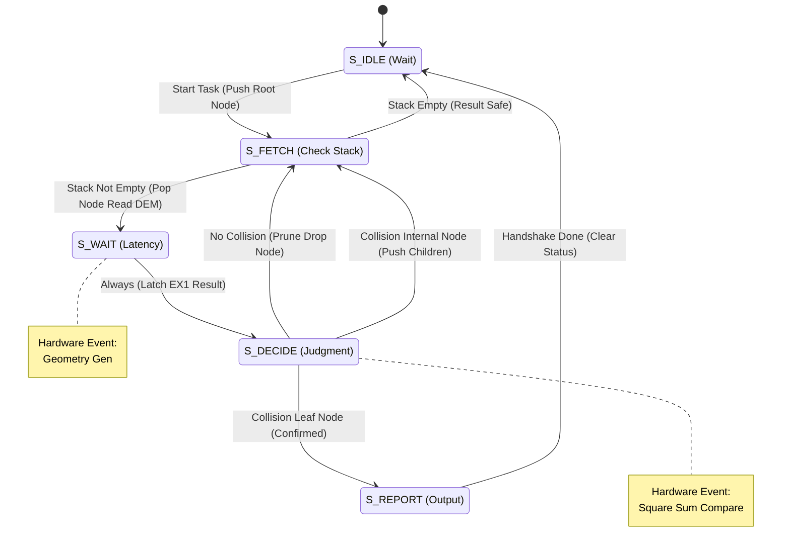

### MPAccel (Motion Planning Accelerator) Hardware Architecture Specification

------

# 1. Document Control (文档控制)

## 1.1 Revision History (版本历史)

| **Version** | **Date**   | **Author** | **Description of Changes**                                   |
| ----------- | ---------- | ---------- | ------------------------------------------------------------ |
| **v0.1**    | 2025-09-01 | lanhui     | Initial Draft. Defined basic concept of S-COPU.              |
| **v0.5**    | 2025-10-15 | lanhui     | Added detailed microarchitecture for CDU and Predictor. Defined Linear Octree format. |
| **v0.9**    | 2025-12-01 | lanhui     | Integrated QUU with probabilistic update policy. Finalized 2-stage pipeline timing. |
| **v1.0**    | 2025-12-22 | lanhui     | **S-COPU Release**. Complete specification including System Integration and Verification Strategy. |
| **v1.1**    | 2026-01-21 | Gemini     | **Renamed to MPAccel**. Integrated SAS (Spatially Aware Scheduler) as top-level scheduler. Defined MPAccel = SAS + S-COPU Kernel. |

## 1.2 Scope (文档范围)

本文档详细定义了 **MPAccel (Motion Planning Accelerator)** 的硬件架构规格。

涵盖范围包括：

- **MPAccel 顶层架构**: 包含 SAS 调度器与 S-COPU 计算核心的集成。
- **SAS (Spatially Aware Scheduler)**: 负责多任务调度与粗粒度并行的前端模块。
- **S-COPU (Safety-Critical Co-Processor Unit)**: 负责几何计算与碰撞检测的核心流水线 (SGU, Predictor, CDU, QUU)。
- **接口与存储**: AXI4-Lite 寄存器映射、数据结构定义。
- 针对 28nm ASIC 及 FPGA 原型的实现与验证策略。

本文档**不**包含：

- 上层驱动程序的源代码实现细节。
- PCB 板级设计与电源管理电路。

------

# 2. Introduction & Overview (项目概述)

## 2.1 Problem Statement (问题陈述)

在现代机器人自主导航与机械臂运动规划（Motion Planning）中，**碰撞检测 (Collision Detection)** 是计算密集的瓶颈环节。

- **计算瓶颈**: 采样算法（如 RRT*, PRM）需要执行成千上万次几何求交测试，占据了规划周期的 80%~90% 时间。
- **架构失配**: 传统的通用处理器 (CPU) 在处理这种海量、随机且非结构化的几何数据时，面临严重的缓存失效 (Cache Miss) 和分支预测失败 (Branch Misprediction) 问题。
- **能效挑战**: 现有的 GPU 加速方案虽然吞吐量高，但功耗巨大且延迟（Latency）不可控，难以满足嵌入式机器人的实时性与能效要求。

## 2.2 Solution: MPAccel (解决方案)

**MPAccel** 是一款专为机器人运动规划设计的 **领域专用架构 (DSA) 加速器**。它采用分层架构，结合了智能调度与专用计算流水线。

MPAccel 的核心组成：

1.  **SAS (Spatially Aware Scheduler)**: 利用运动连续性进行任务调度和粗步长预检，最大化计算资源的利用率。
2.  **S-COPU Kernel Array**: 专用的几何计算核心阵列（默认 4 核），采用 MIMD 架构和近似计算优化（Q2.14 定点数），提供极高的能效比。

核心设计理念：
-   **智能调度 (Smart Scheduling)**: SAS 利用 MCSP 策略管理多任务并发与粗粒度剪枝。
-   **时间相干性 (Temporal Coherence)**: 利用 CHT (Collision History Table) 记忆危险区域。
-   **MIMD 并行集群**: 消除分支发散。

## 2.3 High-Level Architecture (顶层架构概览)

MPAccel 作为一个 AXI 从设备挂载于系统总线上，内部包含两个主要子系统：

1.  **Scheduler (SAS)**:
    -   负责接收上位机的 Motion 任务 (Metadata)。
    -   执行多运动粗步长调度 (MCSP)。
    -   生成 Pose 序列并分发给下游的 S-COPU 计算阵列。
2.  **Kernel Array (S-COPU Instances)**:
    -   MPAccel 包含 $N$ 个（默认 N=4）并行的 S-COPU 计算核心实例。
    -   每个 S-COPU 实例内部包含完整的几何计算流水线：
        -   **Front-End**: SGU (几何生成) & Predictor (历史推断)。
        -   **Execution Core**: 4x CDU Cores (并行碰撞检测) + Distributed Memory.
        -   **Back-End**: Result Collector & QUU (历史更新).

系统架构图示:
Host CPU <--> [AXI4-Lite] <--> SAS ==(Dispatch)==> [S-COPU 0] ... [S-COPU N-1]

## 2.4 Key Specifications (关键技术指标)

| **Feature**       | **Specification**          | **Note**                   |
| ----------------- | -------------------------- | -------------------------- |
| **Architecture**  | MIMD Cluster               | 1 SAS + 4 S-COPUs (16 CDUs)|
| **Map Format**    | Linear Octree (Compressed) | 24-bit Node, Dadu-P Style  |
| **Precision**     | 16-bit Fixed-Point (Q2.14)  | $\epsilon \approx 0.06mm$  |
| **Max Frequency** | **800 MHz** (ASIC 28nm)    | **250 MHz** (FPGA Zynq)    |
| **Memory Size**   | **~45 KB** Total SRAM      | (10.7KB per S-COPU) * 4    |
| **Throughput**    | **> 1600 MQPS** (Est.)     | 400 MQPS per S-COPU        |
| **Power Target**  | **< 200 mW**               | < 50mW per S-COPU core     |
| **Interface**     | AXI4-Lite + Interrupt      | Easy SoC Integration       |

# 3. Interface Description (顶层接口描述)

本章定义 MPAccel 顶层模块的外部接口信号。作为运动规划加速器，MPAccel 主要通过 AXI4-Lite 总线进行任务配置与状态监控，并通过中断信号与主机通信。


## 3.1 Global Signals (全局信号)


全局时钟与复位信号驱动整个 MPAccel 核心逻辑。


| Signal Name | Direction | Width | Description |

| --- | --- | --- | --- |

| `clk` | Input | 1 | **System Clock**. 全局主时钟。ASIC 目标频率 800 MHz，FPGA 建议 250 MHz。 |

| `rst_n` | Input | 1 | **Active Low Asynchronous Reset**. 异步复位信号，低电平有效。 |


## 3.2 Control & Configuration Interface (控制与配置接口)


MPAccel 作为一个从设备 (Slave) 挂载在系统总线上，通过 **AXI4-Lite** 协议接收运动规划任务元数据、配置子模块参数以及读取检测结果位图。


| Signal Name | Direction | Width | Description |

| --- | --- | --- | --- |

| `s_axi_awaddr` / `s_axi_araddr` | Input | 32 | **Address**. AXI4-Lite 地址通道，16位有效地址宽度。 |

| `s_axi_wdata` / `s_axi_rdata` | I/O | 32 | **Data**. 32位数据总线。 |

| ... | ... | ... | 标准 AXI4-Lite 握手信号 (Valid/Ready/Resp)。 |


## 3.3 Task Input Model (任务输入模型)


与传统的逐点输入不同，MPAccel 采用**元数据批处理写入 (Metadata Bulk Write)** 模型：

1.  **Metadata SRAM**: 上位机通过 AXI 总线将一组（最多16个）Motion 的元数据（起始姿态、步进、点数）一次性写入 SAS 内部的元数据存储区。

2.  **Internal Generation**: SAS 根据元数据自动在内部生成关节角度流，并分发给 S-COPU 内核。


## 3.4 Data Output & Interrupt (结果输出与中断)


检测结果通过寄存器位图展示，并通过硬连线中断通知主机。


| Signal Name | Direction | Width | Description |

| --- | --- | --- | --- |

| `irq_o` | Output | 1 | **Interrupt Request**. 电平触发。当一批任务完成或触发早期退出（碰撞/连通）时拉高。 |


## 3.5 System Address Map (系统地址映射)


MPAccel 占用系统总线上的 **64KB** 地址空间。


| **Address Range (Hex)** | **Region Name** | **Description** |

| :--- | :--- | :--- |

| `0x0000 - 0x0FFF` | **SAS CSR Region** | SAS 全局控制、状态寄存器、碰撞结果位图。 |

| `0x1000 - 0x10FF` | **SGU LLUT** | S-COPU Link Look-Up Table (Link与球体映射)。 |

| `0x1100 - 0x14FF` | **SGU URDF Params** | 机器人运动学参数 (Rotation/Translation)。 |

| `0x1500 - 0x1FFF` | **SGU Sphere Geom** | 局部球体几何参数 (x, y, z, r)。 |

| `0x2000 - 0x2FFF` | **DEM Area** | 分布式环境存储器映射区（加载 Octree 地图）。 |

| `0x3000 - 0x3FFF` | **CHT Memory** | 碰撞历史表 (CHT) 直接访问区（调试/初始化）。 |

| `0x4000 - 0x41FF` | **Motion Metadata** | **SAS Metadata SRAM**. 16个 Motion 任务的紧凑存储区。 |

| `0x4200 - 0xFFFF` | *Reserved* | 保留区域。 |


## 3.6 SAS Metadata Slot Layout (元数据槽位结构)


每个 Motion 占用 32 Bytes (`0x20`)：


| 槽内偏移 | 字段名 | 位宽 | 描述 |

| :--- | :--- | :--- | :--- |

| `0x00 - 0x0D` | **Start_Pose** | 112-bit | 起始关节角度向量 (7x16-bit Q3.13)。 |

| `0x0E - 0x1B` | **Step_Delta** | 112-bit | 步进增量向量 (7x16-bit)。 |

| `0x1C - 0x1D` | **Pose_Count** | 16-bit | 该 Motion 的采样点总数 $N$。 |

| `0x1E - 0x1F` | **motion_id** | 16-bit | 运动路径标识符（用于结果追溯）。 |


---


# 4. Global Data Structures (全局数据结构)


## 4.1 Numerical Representation (数值表示)

为了在保持必要计算精度的同时最小化硬件面积和功耗，S-COPU 核心数据通路主要采用 **16-bit 定点数** 格式，但针对不同物理量使用了不同的定点配置。

### 1. Position & Geometry (主要格式)
用于所有笛卡尔空间坐标、半径及距离计算。

- **Format**: **Q2.14** (Signed 2's Complement).
- **Structure**:
  - **Bit [15]**: Sign bit (符号位).
  - **Bit [14]**: Integer part (整数部分, Range $\pm 1$).
  - **Bits [13:0]**: Fractional part (小数部分, Precision $1/16384 \approx 6.1 \times 10^{-5}$).
- **Physical Meaning**:
  - Distance/Position: **Meter (m)**. (Range: $\pm 2m$, Precision: $\approx 0.06mm$).

### 2. Joint Angles (输入格式)
用于输入的关节角度数据，以提供更高的角分辨率。

- **Format**: **Q3.13** (Signed 2's Complement).
- **Range**: $[-4, 4)$ Radian (覆盖 $\pm \pi$ 及略宽范围).
- **Precision**: $2^{-13} \approx 0.00012$ rad ($\approx 0.007^\circ$).

### 3. Internal Rotation Matrices (内部格式)
用于 FK Engine 内部的旋转矩阵计算。

- **Format**: **Q2.14** (Signed 2's Complement).
- **Range**: $[-2, 2)$ (足以表示 $\sin/\cos$ 的 $[-1, 1]$ 范围).

> **Design Note**: 选择 Q2.14 格式是为了适配机器人紧凑的工作空间（通常 $< 1.8m$），并提供亚毫米级的碰撞检测分辨能力（优于 0.1mm）。相比于常用的 Q2.10 格式，Q2.14 提供了更高的精度，且足以覆盖机械臂活动范围。

## 4.2 System Parameters (系统参数)

以下常量定义了硬件的规模和资源限制。

| **Parameter Name** | **Value** | **Description**                                              | **Reference** |
| ------------------ | --------- | ------------------------------------------------------------ | ------------- |
| `PARALLELISM (P)`  | **4**     | 核心流水线的并行通道数。SGU、Predictor 和 CDU 均以此并行度运行。 | User Req      |
| `MAX_SPHERES`      | **64**    | 机器人模型支持的最大球体数量。                               | User Req      |
| `MAX_LINKS`        | **16**    | 支持的最大刚体连杆数量。                                     | Generic       |
| `CHT_DEPTH`        | **4096**  | 碰撞历史表 (CHT) 的条目深度 (4KB Total / 8-bit entry)。      | Source 1      |
| `SRAM_WIDTH`       | **256**   | 局部几何 SRAM 的物理位宽，用于单周期提供 4 个球体数据。      | Optimization  |

## 4.3 Interface Packet Definitions (接口数据包定义)

模块间通信采用 SystemVerilog `struct` 定义的标准数据包。

### 4.3.1 Input & Scheduling Packets (输入与调度数据包)

#### 1. Joint Angles Packet (`joint_angles_t`)

用于内部姿态传递，包含 7 个关节角度数据。

```
typedef struct packed {
    logic [6:0][15:0] angles;    // 7-DOF Joint Angles (Q3.13)
} joint_angles_t;
// Total Width: 7 * 16 = 112 bits
```

#### 2. Motion Metadata Packet (`motion_metadata_t`)

**SAS 专用**。存储在 Metadata SRAM 中，描述一个完整的运动路径任务。

```
typedef struct packed {
    logic [15:0]      motion_id;  // 运动路径标识符
    logic [15:0]      pose_count; // 总采样点数 N
    joint_angles_t    step_delta; // 步进增量向量 (Interpolation Delta)
    joint_angles_t    start_pose; // 起始姿态向量
} motion_metadata_t;
// Total Width: 112 + 112 + 16 + 16 = 256 bits (32 Bytes)
```

#### 3. Pose Packet (`pose_t`)

由 **FK Engine** 输出给 **Transform Engine**，描述单个连杆在世界坐标系下的变换矩阵。

- **Note**: 虽然内部计算使用 16-bit，但为了兼容性，输入接口通常保留 32-bit 或由上游预处理为 16-bit。此处定义为适配内部逻辑的紧凑格式。


```
typedef struct packed {
    // Rotation Matrix (3x3), Row-Major
    logic [15:0] r00, r01, r02;
    logic [15:0] r10, r11, r12;
    logic [15:0] r20, r21, r22;
    // Translation Vector (3x1)
    logic [15:0] tx, ty, tz;
    // Meta Info
    logic [3:0]  padding;
    logic [3:0]  link_id;
} pose_t;
// Total Width: 12 * 16 + 8 = 200 bits
```

### 4.3.2 Sphere Geometry Packet (`sphere_geo_t`)

这是 S-COPU 内部最核心的数据流格式，贯穿 SGU -> Predictor -> Dispatcher。

```
typedef struct packed {
    logic [15:0] cx, cy, cz;     // World Center (Q2.14)
    logic [15:0] radius_sq;      // Radius Squared (Q2.14, Unsigned)
    logic [5:0]  sphere_id;      // Global Sphere Index (0~63)
    logic [3:0]  link_id;        // Associated Link ID
    logic        valid;          // Valid Flag for Lane Masking
} sphere_geo_t;
// Total Width: 4*16 + 6 + 4 + 1 = 75 bits
```

### 4.3.3 Prediction Packet (`pred_packet_t`)

**Internal packet** used within Collision Predictor pipeline (Stage 2 to Stage 3).

```
typedef struct packed {
    sphere_geo_t geo;            // 原始几何信息 (75 bits)
    logic [7:0]  cht_counters;   // CHT History Counters {COLL[3:0], NONCOLL[3:0]}
    logic        is_potential_coll; // 1 = Predict Collision
} pred_packet_t;
// Total Width: 75 + 8 + 1 = 84 bits
```

### 4.3.4 CDU Result Packet (`cdu_result_t`)

用于 CDU -> Result Collector / QUU。

```
typedef struct packed {
    logic        collision;      // 碰撞标志 (1=Collision, 0=Safe)
    logic [5:0]  sphere_idx;     // 任务追踪 ID
    logic [15:0] cx;             // 球心坐标 X (用于 QUU 哈希)
    logic [15:0] cy;             // 球心坐标 Y
    logic [15:0] cz;             // 球心坐标 Z
} cdu_result_t;
// Total Width: 1 + 6 + 3*16 = 55 bits
```

### 4.3.5 CDU Task Packet (`cdu_task_t`)

由 **Dispatcher** 发送给 **CDU (OOCD)**。仅包含 CDU 执行求交测试所需的最小数据集。

```
typedef struct packed {
  logic        valid;          // [79] 1 = valid task, 0 = bubble / invalid
  logic [8:0]  padding;        // [78:70] Reserved (Padding to align)
  logic [5:0]  sphere_id;      // [69:64] 用于结果回溯
  logic [15:0] radius_sq;      // [63:48] Radius Squared (Q2.14)
  logic [15:0] cz;             // [47:32] World Center Z (Q2.14)
  logic [15:0] cy;             // [31:16] World Center Y (Q2.14)
  logic [15:0] cx;             // [15:0]  World Center X (Q2.14)
} cdu_task_t;
// Effective payload: 71 bits (valid bits). Suggested physical alignment: 80 bits (10 bytes).
```

## 4.4 Environment Data Structures (环境数据结构)

定义存储在 **Environment SRAM** 中的八叉树 (Octree) 节点格式，适配 OOCD 架构。

### 4.4.1 Octree Node (`octree_node_t`)

- **Format**: **24-bit Word**

| **Bits**    | **Field**          | **Description**                                              | **Source Ref** |
| ----------- | ------------------ | ------------------------------------------------------------ | -------------- |
| `[23:8]`    | **`child_status`** | 16-bit 状态域。每 2 位表示一个子节点状态 (00:Empty, 01:Inner, 10:Leaf)。 | Dadu-P         |
| `[7:0]`     | **`child_base_idx`** | 子节点组的基地址 (8-bit 支持 256 内部节点)。                 | Dadu-P         |

> Addressing Logic:
>
> 若第 $k$ 个子节点的状态为 `01` (Inner Node)，则其物理地址为：
>
> Address = child_base_idx + PopCount_Inner(child_status[k-1:0])。

## 4.5 Output Result Packet (`result_t`)

用于 `tx_data` 接口，向 Host 报告检测结果。

```
typedef struct packed {
    logic        collision;       // 1 = 发生碰撞
    logic [30:0] padding;         // Reserved / Debug Info
} result_t;
```

# 5. Module Micro-architecture (子模块微架构详解)

MPAccel 的微架构在逻辑上划分为两个主要层级：

1.  **SAS (Spatially Aware Scheduler)**: 顶层调度器，负责多运动任务的管理与粗粒度分发。
2.  **S-COPU Array (S-COPU Instances)**: 具体的几何计算核心阵列。MPAccel 集成了 $N$ 个（默认为 4，最大支持 16）并行的 S-COPU 实例。

**每个 S-COPU 实例**内部包含独立的完整流水线：
-   **SGU (Sphere Generation Unit)**: 几何生成前端。
-   **CP (Collision Predictor)**: 碰撞预测与过滤。
-   **Queue System**: 任务缓冲队列。
-   **Dispatcher**: 任务分发单元。
-   **CDU Cluster (Collision Detection Unit)**: 后端求交计算集群 (含 4 个 CDU Cores)。
-   **QUU (Query Update Unit)**: 历史表更新单元。
-   **Result Collector**: 结果收集。

本章将依次详细描述这些模块的设计。

------

## 5.1 Spatially Aware Scheduler (SAS)

**Spatially Aware Scheduler (SAS)** 是 MPAccel 加速器的中央调度引擎，负责处理碰撞检测中的粗粒度并行（Coarse-grained parallelism）。它通过管理运动规划任务的分发，充分利用机器人运动与环境的空间局部性（Spatial Locality）来最大化计算能效。

### 5.1.1 Functional Overview (功能概述)

SAS 接收上位机通过系统总线下发的**运动规划任务 (Motion Planning Tasks)**。
-   **输入数据**: 上位机提供 Motion 的**元数据 (Metadata)**，包括起始姿态、步进增量和总点数。
-   **调度目标**: SAS 将这些 Motion 映射到下游的 **S-COPU 阵列**（`SAS_GROUP_SIZE` = 4），通过硬件实时插值生成具体的 Pose 关节角度，并根据调度策略流式分发。

SAS 实现 **多运动粗步长调度策略 (MCSP - Multi-motion Coarse-step Scheduling Policy)**：
1.  **多运动并行 (Inter-motion parallelism)**: SAS 维护最多 16 个并发的逻辑 Motion 上下文，并根据物理资源 ($N=4$) 实时调度执行。SAS 采用动态分发机制，根据 S-COPU 核心的实时空闲状态灵活分配任务。
2.  **动态绑定与运行至完成 (Run-to-Completion Binding)**: SAS 将一个 Motion 唯一且持续地绑定到一个 S-COPU 实例，直到该 Motion 完成或被终止。这使得 S-COPU 流水线内无需携带 `Motion ID`，简化了内部逻辑。
3.  **运动内粗步长采样 (Intra-motion CSP)**: 在单个 Motion 内部，SAS 根据 **Step Size** 参数，以跳跃的方式（如索引 0, 8, 16...）生成并发送 Pose。这种“由粗到细”的策略能更早探测到碰撞，从而实现快速剪枝。

### 5.1.2 Operation Modes (操作模式)

SAS 的工作模式通过内部 **AXI-Lite 寄存器** (`REG_CTRL`) 配置，支持以下三种模式以适应运动规划算法的不同阶段：

#### 1. 可行性测试模式 (Feasibility Test Mode)
-   **目的**: 验证一组 Motion 是否**全部安全**。
-   **终止条件**: 一旦组内任何一个 Motion 报告“发生碰撞 (Collision)”，SAS 立即停止所有生成器的调度，触发 **Flush** 信号清除所有 S_COPU 内部队列，并拉高中断报告失败。

#### 2. 连通性测试模式 (Connectivity Test Mode)
-   **目的**: 在多条备选路径中寻找**至少一条可行路径**（常用于路径优化或捷径算法）。
-   **终止条件**: 一旦组内任何一个 Motion 被判定为“无碰撞 (Safe)”（即该 Motion 的所有离散采样点均检测完毕且无碰撞），SAS 立即停止调度并触发 **Flush** 信号中止其他 Motion 的检测，报告成功。

#### 3. 完整测试模式 (Complete Test Mode)
-   **目的**: 获取 Group 内所有 Motion 的详尽碰撞检测结果。
-   **终止条件**: 仅在 Group 内所有 Motion 的所有离散采样点均检测完毕后结束，不进行早期退出。

### 5.1.3 Microarchitecture (微架构设计)

#### 1. Data Reception & Storage (数据接收与存储)
-   **Bulk Write Input**: 为了最大化总线效率，SAS 内部的元数据 SRAM 被映射到系统地址空间。上位机一次性连续写入 16 个 Motion 的元数据包（包括 `Start_Pose`, `Step_Delta`, `Pose_Count`）。Motion ID 由写入地址偏移自动决定。
-   **On-Chip Storage**: SAS 内部集成约 2.56 KB 的 SRAM，分为 16 个槽位。除了元数据，该存储还维护硬件生成的当前索引进度 (Current Index)。
-   **Free Core Pool**: 动态资源管理逻辑维护一个 FIFO 或位图，记录当前 `Ready` 且空闲的 S_COPU 物理核心。

#### 2. Dynamic Scheduling Logic (CD Query Generator)
这是 SAS 的控制核心，负责将 Motion 任务实时分发给 S_COPU 阵列。

-   **Simple Dynamic Scheduler**: 
    -   实时监听 $N$ 个 S_COPU 的 `busy_o` 信号。
    -   采用 **Find-First-Ready (FFR)** 组合逻辑选择空闲核心。
    -   当有 Pending Motion 且有空闲核心时，执行动态绑定，并锁定该核心直到 Motion 完成。
-   **Parallel Interpolator Channels (并行插值通道)**: 
    -   为了最大化吞吐率并消除总线仲裁延迟，SAS 为每个物理 S-COPU 核心配备了**独立的插值计算逻辑与数据总线**。
    -   **Dedicated Context**: 每个通道独立维护当前绑定 Motion 的上下文（Current Pose, Step Delta）。
    -   **Parallel Issue**: 只要对应的 S_COPU `rx_ready` 为高，该通道即可在任意时钟周期独立进行计算并发送数据，互不干扰。
    -   **Stage 1 (Fetch & Compute)**: 读取上下文，计算 `Next_Pose = Curr_Pose + Delta`。
    -   **Stage 2 (Dispatch)**: 将 Pose 通过**专用的 `rx_data[i]`** 推送到对应的 S_COPU 核心。
-   **Motion Issue Iterator**: 
    -   基于 **运动状态寄存器 (`REG_MOTION_STATUS`)** 管理任务生命周期。
    -   迭代器扫描 PENDING 状态并触发调度。当 S_COPU 返回结果时，更新状态为 DONE。

#### 3. Result Processing (结果处理)
-   **Result Monitor & Back-tracing**: 
    -   内部维护 **Binding Scoreboard**，记录 Core ID 到 Motion ID 的映射。
    -   当核心返回 `valid_o` 时，回溯查找对应的 Motion ID，将结果更新到全局位图，并释放核心。
-   **Bitmap Update**: 
    -   `REG_COLLISION_BITMAP`: 记录发生碰撞的 Motion ID。
    -   `REG_MOTION_STATUS`: 即使无碰撞，核心返回 `valid_o` 也会触发状态更新为 DONE。
-   **Early-Exit Controller**: 
    -   根据模式（Feasibility/Connectivity）检查位图状态。
    -   **Feasibility**: 任意碰撞 -> Global Stop。
    -   **Connectivity**: 任意 Safe Done -> Global Stop。
    -   **Global Stop**: 锁定生成器，发送 `soft_rst_i` 清空核心，拉高中断。

#### 4. Interrupt & Status
-   **BUSY**: 从 Start 到所有 Active 任务 Done 或 Global Stop 期间为 '1'。
-   **DONE**: 任务结束时置位，触发 `irq_o` 上升沿。
-   **IRQ Logic**: 硬件自动管理中断状态，支持屏蔽。

### 5.1.4 SAS Interface & Register Map (接口与寄存器)

#### 1. SAS Control Registers (CSR)
位于 SAS CSR Region (`0x0000 - 0x0FFF`)。

| 偏移地址 | 寄存器名 | 类型 | 描述 |
| :--- | :--- | :--- | :--- |
| `0x00` | `REG_CTRL` | RW | Bit[0]: Start (写 1 触发), Bit[2:1]: Mode, Bit[7:3]: Step Size, Bit[31]: Soft Reset。 |
| `0x04` | `REG_STATUS` | RO | Bit[0]: Busy, Bit[1]: Done, Bit[2]: IRQ_Active。 |
| `0x08` | `REG_COLLISION_BITMAP` | RO | **碰撞结论位图 [15:0]**。第 $i$ 位表示任务 $i$ 是否检测到碰撞。 |
| `0x0C` | `REG_MOTION_STATUS` | RO | **全任务状态机 [31:0]**。每 2 位表示一个任务的状态 (00:待处理, 01:执行中, 10:已结束)。 |

#### 2. SAS Internal Interface (To S_COPU Array)
SAS 作为 Master，连接 $N$ ($N \in [4, 16]$) 个物理 S_COPU 实例。

**SAS -> S_COPU (控制与数据总线)**:
-   `rx_valid[N-1:0]`: 针对 N 个核心的独立任务触发信号 (Pose Request)。
-   `rx_data[N-1:0]`: **独立数据分发总线**。每个 S-COPU 拥有自己专用的数据通道，传输 `joint_angles_t` 数据包。这种全互联拓扑 (Full-Connectivity) 允许 SAS 在同一周期向所有核心分发不同的 Pose。
-   `soft_rst_i`: **全局复位/清除信号**。用于早期退出时清空核心内部队列（不清除 CHT）。
-   `cht_rst_i`: **CHT 复位信号**。用于在新环境下的查询开始前清空 S-COPU 内部的碰撞历史表。
-   `scopu_en_i`: 核心使能控制。

**S_COPU -> SAS (状态与结果总线)**:
-   `rx_ready[N-1:0]`: 指示 SGU 是否空闲，可接收下一个 Pose 任务。
-   `busy_o[N-1:0]`: **核心忙指示**。源自 Result Collector，表示核心流水线内仍有未完成的球体任务。SAS 调度器根据此信号判断 Motion 是否全部完成。
-   `valid_o[N-1:0]`: **单次 Pose 检测完成脉冲**。当 S-COPU 完成当前 Pose 所有球体的检测后产生一个脉冲。
-   `collision_o[N-1:0]`: **单次 Pose 碰撞结果**。 `1` 表示当前 Pose 检测到碰撞。SAS 收到此信号后会更新全局位图并可能触发早期退出。

------

## 5.2 Sphere Generation Unit (SGU)

SGU 是 S-COPU 流水线的第一级，负责将输入的机器人关节角度转换为所有覆盖球体在世界坐标系下的绝对坐标。它内部集成了 **正运动学 (Forward Kinematics, FK) 引擎** 和 **并行变换引擎**。

为了支持多种机器人构型并在运行时切换模型，局部几何参数存储在可配置的**片上 SRAM** 中，而非固化的 ROM。

### 5.2.1 Overview (概述)

SGU 的主要功能分为两个阶段：
1. **Forward Kinematics (FK)**: 接收 7-DOF 关节角度，根据配置的机器人几何参数计算各连杆的世界位姿矩阵 (`pose_t`)。
2. **Parallel Rigid-Body Transform**: 接收位姿矩阵，并结合从 SRAM 读取的局部球体参数，计算出每个球体在世界坐标系下的绝对位置。

- **Input**: 关节角度流 (`joint_angles_t`) 和 局部几何配置数据 (Local Geometry Config)。
- **Core Operation**: 
  - $\mathbf{T}_{link} = FK(\theta_{1 \dots 7})$
  - $\mathbf{p}_{world} = \mathbf{R}_{link} \cdot \mathbf{p}_{local} + \mathbf{t}_{link}$
- **Throughput**: 设计目标为 **4 Spheres/Cycle**，以匹配下游预测器的并行度 $P=4$。

### 5.2.2 Module Interface (接口定义)

SGU 接口增加了 **Configuration Port**，用于通过 AXI4-Lite 总线或本地适配器初始化机器人模型参数（包括连杆位姿参数和球体几何）。
```
module sphere_gen_unit import scopu_pkg::*; (
    input  logic           clk,
    input  logic           rst_n,

    // 1. Configuration Interface (SRAM/Register Write Access)
    input  logic           cfg_we_i,      
    input  logic [11:0]    cfg_addr_i,    // Local Offset (Base 0x1000 removed). 0x000: Sphere SRAM, 0x100: URDF Parameters
    input  logic [63:0]    cfg_data_i,    

    // 2. Joint Input Interface (From Top rx_data)
    input  joint_angles_t  angles_i,      // 7-DOF Joint Angles
    input  logic           angles_valid_i,
    output logic           angles_ready_o, 

    // 3. Sphere Output Stream (To Predictor)
    output sphere_geo_t [PARALLELISM-1:0] sphere_o,
    output logic                          valid_o,
    input  logic                          ready_i
);
```

------

### 5.2.3 Local Geometry SRAM (局部几何配置存储)

该子系统是 SGU 的静态数据源，存储机器人所有刚体连杆包含的碰撞检测球体参数。为了适应 $P=4$ 的高吞吐率并在运行时支持不同机器人模型，该 SRAM 采用宽字（Wide-Word）架构。

#### 1. Data Entry Format (数据条目格式)

为了最大化存储效率并降低计算开销，每个球体的几何参数被压缩为 **64-bit** 的数据包。硬件将其视为 4 个连续的 16-bit 定点数。

- **Numeric Format**: **16-bit Fixed-Point (Q2.14)**.
  - Range: $\pm 2$ meters.
  - Resolution: $\approx 0.06 \text{ mm}$.

| **Bits**  | **Field Name** | **Type** | **Description**           |
| --------- | -------------- | -------- | ------------------------- |
| `[15:0]`  | `loc_x`        | Int16    | 局部坐标 X (Q2.14)        |
| `[31:16]` | `loc_y`        | Int16    | 局部坐标 Y (Q2.14)        |
| `[47:32]` | `loc_z`        | Int16    | 局部坐标 Z (Q2.14)        |
| `[63:48]` | `radius_sq`    | Uint16   | 半径的平方 (Q2.14 Unsigned) |

#### 2. Physical Memory Organization (物理存储组织)

为了在一个时钟周期内向 4 个并行变换流水线 (Lanes) 提供数据，SRAM 的物理位宽设计为单个球体位宽的 4 倍。

- **Physical Width**: **256 bits** ($4 \times 64 \text{ bits}$).
- **Depth**: 16 Lines (支持总共 $16 \times 4 = 64$ 个球体).
- **Total Size**: 4 Kbits (0.5 KB).
- **Read Port**: 单周期读取一行 (Line)，数据总线 `sram_rdata [255:0]` 被直接拆分为 4 组送入 Lane 0 ~ Lane 3。

#### 3. Addressing Mechanism (寻址机制)

由于不同 Link 包含的球体数量差异巨大，SGU 内部维护一个 **Link Look-Up Table (LLUT)** 来管理每个 Link 在 SRAM 中的物理存储位置。

3.1 Link Look-Up Table (LLUT)

这是一个小型寄存器堆 (Register File)，在系统初始化阶段配置。

- **Capacity**: 16 Entries (支持最多 16 个 Link).
- **Entry Structure**:
  - `Start_Row_Addr` (4 bits): 该 Link 数据在 SRAM 中的起始**行号** (0~15)。
  - `Sphere_Count` (6 bits): 该 Link 包含的球体总数。

3.2 Runtime Address Calculation (运行时地址计算)

当流水线处理 Link $N$ 时，控制器执行以下逻辑：

1. **Table Lookup**: 根据当前处理的 `link_id` (即 $N$) 查表，获取 `Start_Row_Addr` 和 `Sphere_Count`。

2. **Burst Reading**: 启动一个计数器 `burst_cnt`。

   - SRAM Read Address:
   
     $$Addr_{SRAM} = Start\_Row\_Addr + burst\_cnt$$

   - 每周期 `burst_cnt` 加 1，直到读取的球体数量覆盖 `Sphere_Count`。

3.3 Lane Masking Logic (通道掩码逻辑)

当 Sphere_Count 不是 4 的倍数时，最后一次 Burst 读取会包含无效数据。SGU 控制器根据剩余未处理球体数量动态生成 valid_mask。

- *Example*: 若 Link A 剩余 3 个球体，则 Lane Mask 逻辑将驱动输出数组中对应的有效位：`sphere_o[0..2].valid = 1`，`sphere_o[3].valid = 0`。

#### 4. Configuration Interface (配置写入接口)

由于 SRAM 物理位宽 (256-bit) 远大于配置总线 AXI4-Lite 的位宽 (32-bit)，写入操作需要通过 **拼包缓冲区 (Assembly Buffer)** 完成。

- **Assembly Buffer**: 一个 256-bit 的移位寄存器或缓冲器。
- **Write Sequence**:
  1. Host 通过 AXI4-Lite 连续写入 8 次 32-bit 数据 (填充 4 个球体的完整参数)。
  2. 数据被依次填入 Assembly Buffer。
  3. 当 Buffer 填满，或检测到 Host 发出的 `COMMIT` 指令（或地址跳转）时，SGU 触发一次宽字 SRAM 写操作 (`mem_we = 1`)，将 Buffer 内容写入 `Start_Row_Addr` 指向的物理行。
- **Alignment Constraint**: 软件需保证每个 Link 的球体数据从新的物理行起始位置开始写入 (256-bit Aligned)。

### 5.2.4 Forward Kinematics (FK) Engine (正运动学引擎)

**Forward Kinematics (FK) Engine** 是 S-COPU 几何流水线的起点。它负责执行机器人的正运动学解算，将输入的 **关节角度 (Joint Angles, $\mathcal{Q}$)** 实时转换为各连杆在世界坐标系下的 **位姿矩阵 (Link Poses, $SE(3)$)**。

该模块经过重新设计，以原生支持 **URDF (Unified Robot Description Format)** 标准，并针对 **串联机械臂 (Serial Chain Manipulators)** 进行了深度优化。为了进一步降低面积和功耗，采用了基于稀疏矩阵特性的优化算法。

#### 1. Mathematical Model (数学模型)

FK Engine 采用了更通用的基于 URDF 定义的树状（简化为串联）变换累积法。

对于串联结构中的第 $i$ 个连杆：

$$T_{world, i} = T_{world, i-1} \times T_{local, i}$$

其中局部变换 $T_{local, i}$ 定义为：

$$T_{local, i} = T_{fixed, i} \times T_{joint, i}(q_i)$$

- **$T_{fixed, i}$**: 对应 URDF 中的 `<origin>` 标签。描述关节坐标系相对于父连杆的固定位姿。在硬件中，为了压缩存储，$R_{fixed}$ 被映射为标准正交旋转 ID (`rot_id`)。
- **$T_{joint, i}(q_i)$**: 对应 URDF 中的 `<axis>` 标签。描述关节随角度 $q_i$ 的运动。为简化硬件，**仅支持标准轴 (X, Y, Z)** 旋转。

**计算优化 (Sparse & Permutation)**:
利用机器人学中绝大多数固定变换 ($T_{fixed}$) 的旋转部分 ($R_{fixed}$) 均为标准正交矩阵（元素仅为 0, 1, -1）这一特性，我们将昂贵的通用矩阵乘法替换为 **“排列 (Permutation) + 符号翻转 (Sign Flip)”** 操作。
$$R_{accum\_next} = (R_{accum} \cdot R_{perm}) \cdot R_{axis}(q_i)$$
其中 $R_{accum} \cdot R_{perm}$ 不消耗乘法器，仅通过 MUX 实现列交换和符号控制。

#### 2. Hardware Microarchitecture (硬件微架构)

为了在 **800 MHz** 时序约束下实现高吞吐率，FK Engine 采用 **流式处理 (Streaming Architecture)** 配合内部 FIFO。

**Stage 1: Input Buffer & Serializer (输入缓冲与串行化)**
- **Function**: 
  - 接收宽总线输入 (`joint_angles_t`) 并存入内部 FIFO。
  - 状态机 (`link_cnt`) 依次解包每个连杆的配置参数 (`rot_id`, `tx/ty/tz`, `axis_type`)。
  - 控制 `Sin/Cos Unit` 计算当前关节角 $q_i$ 的正余弦值。

**Stage 2: Sparse Rotation & Permutation (稀疏旋转与排列)**
- **Function**: 执行旋转累积 $R_{next} = R_{curr} \cdot R_{local}$。
- **Implementation**: 
  - **Permutation**: 根据 `rot_id` 解码出的控制信号，对累加器 $R_{curr}$ 的列向量进行重排和符号调整，得到中间矩阵 $R'$。此步耗时极短，无乘法器。
  - **Sparse Rotation**: 根据 `axis_type` (X/Y/Z)，将 $R'$ 与旋转矩阵 $R_{axis}(q_i)$ 相乘。由于 $R_{axis}$ 是稀疏的，原本 27 次乘法被减少为 **12 次乘法**。

**Stage 3: Translation & Update (平移与更新)**
- **Function**: 执行平移累积 $t_{next} = t_{curr} + R_{curr} \cdot t_{local}$。
- **Implementation**: 
  - 利用 9 个乘法器计算 $R_{curr} \cdot t_{local}$。
  - 加法器完成最终累加。
  - 结果写入累加器寄存器，并输出给下游 SGU。

#### 3. Configuration Memory (配置存储)

采用高度压缩的存储格式，每个 Link 仅占用 **64 bits**。

- **Memory Layout (64-bit per Link)**:
  - `[62:58]` **rot_id**: 5-bit ID，映射到 24 种标准正交旋转。
  - `[57:10]` **Translation**: 3 x 16-bit (Q2.14) $t_x, t_y, t_z$。
  - `[9]` **Active**: 是否参与计算。
  - `[8]` **Is_Last**: 链末端标志。
  - `[7:6]` **Axis_Type**: 关节轴类型 (X/Y/Z/Fixed)。
  - `[5:2]` **Joint_Idx**: 关联的关节索引。
  - `[1]` **Invert_Axis**: 轴反向标志。

#### 4. Interface Definition (接口定义)

```verilog
module fk_engine import scopu_pkg::*; (
    input  logic           clk,
    input  logic           rst_n,

    // Input: Joint Angles from Task Queue (Buffered)
    input  logic           valid_i,
    output logic           ready_o,
    input  joint_angles_t  angles_i,
    
    // Output: Link Poses Stream to Parallel Transform Engine
    output logic           pose_valid_o,
    output pose_t          pose_data_o,
    output logic [LINK_IDX_W-1:0] link_id_o,
    output logic           last_link_o,
    
    // Backpressure from SGU
    input  logic           pose_ready_i 
);
```


### 5.2.5 Parallel Transform Engine (并行变换引擎)

该引擎是 SGU 的算力核心。为了在保持 $P=4$ 高吞吐率的同时最小化硬件复杂度。

#### 1. Architecture Strategy (架构策略)

为了避免在计算流水线中引入昂贵的多路选择器 (MUX) 和多套位姿寄存器，我们制定如下数据流规则：

- **Pose Consistency Constraint (位姿一致性约束)**: 在任意给定的时钟周期内，所有 4 个计算通道 (Lanes) 只能使用**同一套**位姿矩阵 ($\mathbf{R}, \mathbf{t}$)。
- **Boundary Padding (边界填充)**: 当某个 Link 的球体数量不是 4 的倍数时（例如 Link N 只有 3 个球），该周期的剩余通道 (Lane 3) 将被标记为无效 (Invalid/Bubble)。Link N+1 的数据将在**下一个**时钟周期，等待位姿寄存器更新为 Pose N+1 后开始处理。

#### 2. Hardware Structure (硬件结构)

每个计算通道包含 2 级流水线，配合全局广播的位姿影子寄存器。

- **Global Components (Shared by all lanes)**:
  - **Active Pose Register**: 存储当前正在处理的 Link 的变换矩阵。
    - `curr_R` (9 x 16-bit Q2.14)
    - `curr_t` (3 x 16-bit Q2.14)
  - **Direct Interface**: 直接连接 FK Engine 的输出端口，无中间大容量 Buffer。
- **Per-Lane Micro-architecture (Lane 0 ~ 3)**:
  - **Input**: `loc_x`, `loc_y`, `loc_z` (来自 SRAM), 以及全局广播的 `curr_R`, `curr_t`。
  - **Stage 1: Rotation (Multiplication & Summation)**:
    - 执行 9 次乘法并累加: $rot\_val = \sum (coord \times r_{ij})$。
    - *Format*: Q2.14 $\times$ Q2.14 $\to$ Q4.28 $\to$ Q2.14。
  - **Stage 2: Translation & Rounding**:
    - 加平移并截断输出: $res = rot\_val + t$。
  - **Data Gating**: 如果 `valid_mask[lane]` 为 0，该 Lane 的流水线寄存器时钟被门控 (Clock Gated) 以节省动态功耗，输出强制为 0。

#### 3. Execution Flow Example (执行流示例)

假设 Link A 有 3 个球体，Link B 有 4 个球体。

- **Cycle $T$ (Handshake Link A)**:
  - SGU Assert `next_link_req_i`. FK Engine provides **Pose A** (Ready).
  - SGU Latches **Pose A** and `is_last_link` flag.
- **Cycle $T+1$ (Processing Link A)**:
  - **SGU**: Reads SRAM (Link A, Row 0) and executes transform.
  - **FK Engine**: Starts computing **Pose B** in parallel.
  - **Lanes**:
    - Lane 0~2: Valid (Sphere A_0 ~ A_2).
    - Lane 3: Invalid Bubble.
  - **Control**: End of Link A detected. Assert `next_link_req_i`.
- **Cycle $T+2$ (Handshake Link B)**:
  - FK Engine provides **Pose B** (Already computed or ready).
  - SGU Latches **Pose B**.
- **Cycle $T+3$ (Processing Link B)**:
  - **SGU**: Reads SRAM (Link B, Row 0).
  - **Lanes**: Lane 0~3 Valid.

#### 4. DSP Resource Analysis (资源分析)

- **Multipliers**: $4 \text{ Lanes} \times 9 \text{ Muls} = 36$ DSPs.

- **Efficiency**: 虽然在 Link 边界处可能有 1-3 个乘法器空闲（Bubble），但避免了复杂的 MUX 网络，使得这 36 个 DSP 能运行在更高的频率（例如 800MHz），从而获得更高的总吞吐量 (Total OPS)。
------


### 5.2.6 Control Logic & FSM (控制逻辑与状态机)

SGU 控制器是一个集中式的有限状态机 (FSM)，负责管理配置与计算模式，并协调关节输入、FK 触发、SRAM 读取及流水线流控。

#### FSM State Definition (状态定义)

控制器维护一个 **Link 迭代计数器 (`link_idx`)** 和核心状态机：

- **IDLE (空闲)**: 系统复位后的默认状态。
  - 监听 `cfg_we_i`：若有效 $\rightarrow$ `CONFIG_ACCESS`。
  - 监听 `angles_valid_i`：若有效且无配置请求 $\rightarrow$ 锁存输入，复位 `link_idx = 0`，跳转至 `WAIT_POSE`。
- **CONFIG_ACCESS (配置访问)**: 处理 AXI4-Lite 写请求，更新 Assembly Buffer 或寄存器。
- **WAIT_POSE (等待位姿)**:
  - *Action*: Assert `next_link_req_i` to request next link pose from FK Engine.
  - *Transition*: Wait for `pose_valid_o` from FK Engine.
    - If `pose_valid_o == 1`: Latch `pose_data_o` and `last_link_o` into internal registers, then jump to `LATCH_PARAMS`.
- **LATCH_PARAMS (参数锁存)**:
  - *Action 1*: Update Shadow Registers with latched pose and `is_last_link` flag.
  - *Action 2*: 根据 `link_id_o` (from FK) **异步读取** Link Look-Up Table (LLUT) 获取 `Start_Addr` 和 `Total_Count`。
  - *Pre-fetch*: 利用获取的 `Start_Addr`，**提前发出 `STREAM_RUN` 所需的第一个 SRAM 读地址**。
  - *Transition*: 下一周期无条件跳转至 `STREAM_RUN`。
- **STREAM_RUN (流式运行)**:
  - *Action*: 持续读取 SRAM，递增 `burst_cnt`。
  - *Exit Condition*: 当当前 Link 的所有球体处理完毕：
    - Assert `next_link_req_i` to FK Engine (Pre-request next link).
    - 若 `is_last_link` (Latched) 为 1：跳转至 `DONE`。
    - 若 `is_last_link` 为 0：返回 `WAIT_POSE`。
- **DONE (完成)**:
  - *Action*: 断言 `angles_ready_o`，完成握手。
  - *Transition*: 返回 `IDLE`。
------

### 5.2.7 Pipeline Details (流水线详解)

本节详细描述 SGU 从接收到新任务（Joint Angles）到流水线进入满载状态的时序行为，重点阐述 FK Engine 与 Parallel Transform Engine 之间的握手与并行机制。

#### 1. Pipeline Stages (流水线级数)

整个几何生成流水线可以划分为以下几个逻辑阶段：

1.  **FK Calculation (FK)**: 正向运动学计算。计算一个 Link 的位姿 ($T_0^i$)。
2.  **Pose Handshake (HS)**: 1 Cycle。FK 将世界坐标系下的变换矩阵传递给Parallel Transform Engine，Parallel Transform Engine锁存并查找 LLUT。
3.  **SRAM Fetch (MEM)**: 1 Cycle。根据 LLUT 信息读取球体几何参数。
4.  **Transform (EX1/EX2)**: 2 Cycles。旋转与平移计算。
5.  **Output (WB)**: 1 Cycle。输出有效球体数据。

#### 2. Startup Sequence (启动序列)

当 SGU 处于 `IDLE` 状态并接收到一组新的关节角度时，启动过程如下：
-   **T0 (Input Latch)**: SGU 锁存 `angles_i`，状态转为 `WAIT_POSE`。同时 FK Engine 开始计算 Link 0 的位姿。
-   **T1...Tk (FK Latency)**: FK Engine 正在计算 Link 0。Parallel Transform Engine 处于等待状态 (Stall)。
    -   *注：Link 0 通常是基座，计算很快或为固定值。*
-   **Tk+1 (Pose Ready)**: FK Assert `pose_valid_o`。
-   **Tk+2 (Latch & Lookup)**: Parallel Transform Engine 锁存 Link 0 的世界坐标系1，同时读取 LLUT 获取 Link 0 的球体数量 ($N_0$) 和起始地址。状态转为 `LATCH_PARAMS`。
-   **Tk+3 (Pre-fetch)**: Parallel Transform Engine 发出 Link 0 第一个 Burst 的 SRAM 读地址。状态转为 `STREAM_RUN`。
-   **Tk+4 (Stream Start)**: Link 0 的第一组数据从 SRAM 读出。
-   **Tk+6 (First Output)**: Link 0 的第一组变换结果输出到 `sphere_o`。

#### 3. Steady State & Link Switching (稳态与切换)

一旦进入 `STREAM_RUN`，Parallel Transform Engine 满载工作。同时，FK Engine 并行计算下一个 Link 的位姿。
-   **Parallel Execution (并行执行)**:
    -   Parallel Transform Engine: 正在处理 Link $i$ 的球体 (Burst Reading)。
    -   FK: 正在计算 Link $i+1$ 的位姿。
-   **Seamless Switching (无缝切换)**:
    -   如果 FK 计算 Link $i+1$ 的时间 **小于** Parallel Transform Engine 处理 Link $i$ 的时间：
        -   FK 会在 Parallel Transform Engine 完成 Link $i$ 之前就绪，并等待 (Stall)。
        -   当 Parallel Transform Engine 完成 Link $i$ (Last Burst)，立即握手接收 Link $i+1$。
        -   **Pipeline Bubble**: 仅存在 1-2 个周期的切换开销 (Latch & Pre-fetch)，几乎实现无缝流式输出。
    -   如果 FK 计算慢于 Parallel Transform Engine (例如 Link $i$ 只有很少球体)：
        -   Parallel Transform Engine 完成 Link $i$ 后，必须等待 FK 完成 Link $i+1$。流水线将插入气泡。

------

## 5.3 Collision Predictor (CP)

CP 是 S-COPU 的推测核心。它负责将 SGU 生成的球体流映射到碰撞历史表 (CHT) 并输出预测结果。

**架构变更说明**: 本模块专注于 **只读预测 (Read-Only Prediction)**。CHT 的写回与状态更新由独立的 **Query Update Unit (QUU)** 负责。CP 仅为 QUU 提供必要的 SRAM 写访问接口。

### 5.3.1 Module Interface (接口定义)

CP 的接口包含两条主要路径：前向预测路径（数据流）和后向更新接口（存储器访问）。

```
module collision_predictor_top #(
    parameter RATIO_SHIFT = 1 // 默认比率移位参数
) import scopu_pkg::*; (
    input  logic           clk,
    input  logic           rst_n,

    // 1. Forward Prediction Stream (From SGU)
    // 接收 4 个球体的几何信息
    input  sphere_geo_t [PARALLELISM-1:0] sphere_i,
    input  logic                          valid_i,
    output logic                          ready_o, // Back-pressure SGU

    // 2. Direct Queue Interfaces
    // Path A: To Q_COLL (High Priority, Serial/Narrow)
    // 即使上游 P=4，这里一次通常只写 1 个 (除非你决定做 Multi-bank FIFO)
    output cdu_task_t      q_coll_wdata_o,
    output logic           q_coll_we_o,
    input  logic           q_coll_full_i,  // Back-pressure Source 1

    // Path B: To Q_NONCOLL (Low Priority, Parallel/Wide)
    // 必须支持一次写入 4 个任务 (Wide Bus, Valid bits embedded)
    output cdu_task_t [3:0] q_noncoll_wdata_o, 
    output logic            q_noncoll_we_o,   // Global Write Enable
    input  logic            q_noncoll_full_i, // Back-pressure Source 2
);
```


------

### 5.3.2 Parallel Hash Engine (并行哈希引擎)

该引擎由 4 个独立的哈希通道 (Hash Lanes) 组成，负责将球体的世界坐标映射为 12-bit 的 CHT 物理地址。为了追求极致的硬件效率，我们采用 **固定位提取与拼接 (Fixed Bit Extraction & Concatenation)** 策略。

#### 1. Algorithm: COORD Strategy (COORD 策略)

我们将 3D 空间映射为一个 $16 \times 16 \times 16$ 的虚拟索引空间（共 4096 个条目）。

- Logic Formula:

  $$Index = \{ \mathcal{Q}(x), \mathcal{Q}(y), \mathcal{Q}(z) \}$$

  其中 $\mathcal{Q}(v)$ 是从 16-bit 定点数 $v$ 中提取的 4-bit 索引值，$\{...\}$ 表示位拼接。

- Quantization Logic:

  直接提取输入坐标的高 4 位：
  $$\mathcal{Q}(v) = v[15:12]$$


#### 2. Address Mapping to Banked Memory (地址映射策略)

为了在 8-Bank 存储架构下最大化并行访问效率，我们采用 **三维交错 (3D Interleaving)** 映射策略。

- Logic Description:

  我们将 4-bit 量化索引 idx_x, idx_y, idx_z 的最低有效位 (LSB) 提取出来，组合成 3-bit 的 Bank 选择信号。剩余的高位用于生成行地址。

- **Mapping Formula**:

  - Bank Select (3 bits):

    $$Bank\_ID = \{ \text{idx\_x}[0], \ \text{idx\_y}[0], \ \text{idx\_z}[0] \}$$

    - **物理意义**: 这相当于将 3D 空间染成 8 种颜色的立体棋盘。任何两个在空间上相邻（共享面）的体素，其 Bank ID 至少有一位不同，因此必定位于不同的 Bank。这对于处理连续的球体流（Stream of Spheres）极为有效。

  - Row Address (9 bits):

    $$Row\_Addr = \{ \text{idx\_x}[3:1], \ \text{idx\_y}[3:1], \ \text{idx\_z}[3:1] \}$$

    - 我们将 x, y, z 剩余的 3 个高位 (MSBs) 拼接，形成 9-bit 的 Bank 内部寻址 ($2^9 = 512$ Rows)。

#### 3. Area & Timing (PPA 预估)

- **Area**: 接近 **零**。每个通道仅涉及信号线的重新物理映射，不消耗任何逻辑单元（如移位器）。
- **Timing**: 纯布线延迟。这使得 Hash 级完全透明，不占用任何时钟周期或建立时间时间。

  

### 5.3.3 Banked CHT Memory System (多体存储子系统)

为了支持 $P=4$ 的并行预测读取以及来自 QUU 的异步写入，CHT 被物理分割为 **8 个 SRAM Banks**。

- **Memory Spec**:
  - **Total Capacity**: 4KB.
  - **Organization**: 8 Banks $\times$ 512 Entries $\times$ 8-bit.
  - **Technology**: Single-Port SRAM (为了面积效率)。
- **Banking Strategy**:
  - 采用 **低位交叉 (Low-order Interleaving)**：连续的空间哈希值通常映射到不同的 Bank，从而最大化并行访问的概率。

### 5.3.4 Conflict Resolution Arbiter (读写仲裁器)

由于 4 个预测通道 (Lanes) 和 1 个更新通道 (QUU) 可能在同一周期竞争同一个 SRAM Bank，需要一个仲裁器来管理访问。

- **Arbitration Scope**: 针对每个 Bank 独立仲裁。
- **Priority Scheme (优先级策略)**:
  1. **QUU Update (最高优先级)**: 保证历史表的更新不被阻塞，确保预测器尽快获取最新状态（Safety First）。
  2. **Lane 0 > Lane 1 > Lane 2 > Lane 3**: 固定优先级解决预测通道间的冲突。
- **Stall Logic**:
  - 如果 Lane $k$ 访问 Bank $M$ 失败（因为 QUU 正在写 Bank $M$，或 Lane $j (j<k)$ 正在读 Bank $M$），则产生 `stall_lane_k` 信号。
  - **Global Stall**: 只要有任意一个 Lane 被阻塞，整个 CP 流水线（以及上游 SGU）必须暂停 (`ready_o = 0`)，直到冲突解决。
- **Replay**: 被阻塞的请求将在下一周期自动重试。

------

### 5.3.5 Prediction & Routing Logic (预测与路由逻辑)

本模块位于 CP 流水线的 **Stage 3**（或组合逻辑级联在 Stage 2 之后）。它接收从 SRAM 读回的计数器数据，执行比率预测算法，并根据预测结果将球体任务分流至 **Q_COLL**（串行化路径）或 **Q_NONCOLL**（并行路径）。

#### 1. Prediction Core (预测核心)

首先，对 4 个并行通道执行独立的预测判决。算法采用 Shah et al. (2024) 提出的比率比较法，并针对硬件进行了移位优化。


#### 2. Hybrid Routing Architecture (混合路由架构)

根据 `is_potential_coll` 标志，数据流被拆分为两条路径：

- **Path A (Safe Stream)**: 吞吐率 **4 Spheres/Cycle**。
  - 所有被标记为安全的球体，在本周期内**一次性**打包写入宽字接口的 `Q_NONCOLL`。
- **Path B (Collision Stream)**: 吞吐率 **1 Sphere/Cycle**。
  - 所有被标记为碰撞的球体，必须通过 **串行化 FSM (Serializer)** 逐个写入窄接口的 `Q_COLL`。
  - 如果同一周期出现多个碰撞球体，流水线将发生 **Stall**。

#### 3. Collision Serializer FSM (碰撞串行化状态机)

这是本单元的控制核心，负责处理“多碰撞拥塞”。

- **State Definitions**:
  - `PASS`: 默认状态。处理当前周期的输入。
  - `REPLAY`: 重播状态。处理上一周期遗留的、未写入的碰撞球体。
- **Logic Flow**:
  1. **Input Masking**:
     - 在 `PASS` 状态，输入掩码 `mask_in` = `is_potential_coll[3:0]`。
     - 在 `REPLAY` 状态，输入掩码 `mask_in` = `remaining_mask_reg`。
  2. **Priority Encoding**:
     - 使用优先编码器 (Priority Encoder) 找到 `mask_in` 中最低位的 '1'（假设为 Lane $k$）。
  3. **Output Generation**:
     - `q_coll_we_o` = 1 (只要 mask_in 不为 0)。
     - `q_coll_wdata_o` = Lane $k$ 的任务包。
  4. **Next State Logic**:
     - 计算 `remaining_mask` = `mask_in` & ~(1 << $k$)。
     - 如果 `remaining_mask == 0`: 跳转回 `PASS`，释放反压。
     - 如果 `remaining_mask != 0`: 跳转至 `REPLAY`，锁存剩余掩码，并断言 `stall_upstream`。
- **Example Scenario**:
  - **T0**: Lanes {0, 2} 预测为碰撞。
  - **T0 (Logic)**: Encoder 选中 Lane 0。写入 Lane 0。剩余 mask={2}。断言 Stall。
  - **T1 (Replay)**: Encoder 选中 Lane 2。写入 Lane 2。剩余 mask={0}。解除 Stall。
  - **T2**: 恢复处理下一批数据。

#### 4. Safe Task Packer (安全任务打包)

安全路径是纯组合逻辑，无状态，不阻塞（除非下游 FIFO 满）。

#### 5. Back-pressure Aggregation (反压聚合)

CP 何时能接收 SGU 的新数据？必须满足三个条件：

1. **Serializer Idle**: 当前没有正在处理的多周期碰撞任务（即 FSM 处于 `PASS` 状态，且当前周期能处理完所有碰撞）。
2. **Q_COLL Ready**: 如果有碰撞任务，Q_COLL 必须不满。
3. **Q_NONCOLL Ready**: 如果有安全任务，Q_NONCOLL 必须不满。


**设计意图总结 (Architect's Note):**

通过这种**"Parallel-Safe / Serial-Collision"** 的非对称设计，我们完美解决了带宽匹配问题：

- **Common Case (全安全)**: 1 个周期完成路由，吞吐率 4 Spheres/Cycle。
- **Rare Case (多碰撞)**: 只有在极少数情况下（多个球体同时预测碰撞）才会降低流水线速度。
- 这符合 **Amdahl 定律**：优化高频场景（安全球），处理低频场景（碰撞球）。

------

### 5.3.6 Physical Pipeline View (物理流水线视图)

为了在处理复杂的非对称路由逻辑时仍能保持高主频（Target: 800MHz+），CP 采用 **3 级深度流水线**。

流水线必须处理两类反压源：

1. **Bank Conflict (Stage 1)**: 多个通道争抢同一个 SRAM Bank。
2. **Serializer Busy (Stage 3)**: 多个通道同时预测为碰撞，需要多周期串行写入。

#### **Pipeline Stage 1: Hash, Arbitrate & Address (哈希、仲裁与寻址)**

这是 SRAM 访问的发起级。

- **Logic Operations**:
  1. **COORD Hash**: 对 4 个输入的球体坐标执行移位和拼接，生成 `Bank_ID` 和 `Row_Addr`。
  2. **Bank Arbitration**: 检查 4 个 Lane + QUU 的 Bank 冲突。根据优先级（QUU > L0...）决定谁能访问。
  3. **SRAM Drive**: 驱动获胜请求的地址线和片选信号 (`cen`)。
- **Stall Behavior**:
  - 若发生 Bank 冲突，未获胜的 Lane 触发 **Local Replay**（在当前级保持，下一周期重试）。
  - 若收到 Stage 3 的 **Global Stall**，全级冻结。

#### **Pipeline Stage 2: Readback, Compare & Align (读回、比较与对齐)**

这是预测计算级，对应 SRAM 的数据返回周期。

- **Logic Operations**:
  1. **Data Capture**: 锁存 SRAM 读出的 8 个 Bank 数据，并根据 Stage 1 传递的路由信息，将正确的数据分发给对应的 Lane。
  2. **Ratio Prediction**: 执行 `cnt_coll > (cnt_noncoll >> S)` 比较逻辑，生成 4 个 `is_potential_coll` 标志位。
  3. **Geometry Alignment**: 将原始球体几何信息 (`sphere_geo_t`) 通过流水线寄存器透传，确保与预测结果对齐。
- **Stall Behavior**:
  - 若收到 Stage 3 的 **Global Stall**，流水线寄存器保持不变 (Clock Gating)。

#### **Pipeline Stage 3: Routing & Serialization (路由与串行化)**

- **Logic Operations**:
  1. **Mask Generation**: 根据 Stage 2 的输入生成 `coll_mask` (需要串行处理) 和 `safe_mask` (可以并行处理)。
  2. **Path A (Safe Stream)**:
     - 将所有 `safe_mask` 置位的任务并行打包。
     - 驱动 `q_noncoll_wdata` (Wide Bus) 和 `we` 信号。
  3. **Path B (Collision Stream)**:
     - 输入进入 **Collision Serializer**。
     - **Priority Encoder** 选择 `coll_mask` 中最低位的碰撞球体。
     - 驱动 `q_coll_wdata` (Narrow Bus) 和 `we` 信号。
- **Serializer FSM & Stall Generation**:
  - 如果 `pop_count(coll_mask) > 1`（即有多个碰撞）：
    - FSM 进入 `REPLAY` 状态。
    - 断言 **`stall_upstream` (Global Stall)** 信号。这会冻结 Stage 1 和 Stage 2，阻止新数据进入。
    - 在接下来的周期中，FSM 逐个处理剩余的碰撞球体。
  - 一旦所有碰撞处理完毕，释放 `stall_upstream`，流水线恢复流动。

------

### Pipeline Timing Diagram (流水线时序图例)

假设输入序列：

- **T0**: Data A (Lane 0, 1 碰撞; Lane 2, 3 安全) —— **严重拥塞**。
- **T1**: Data B (全安全)。

| **Clock** | **Stage 1 (Hash)** | **Stage 2 (Predict)** | **Stage 3 (Route)**     | **Action / Status**                                          |
| --------- | ------------------ | --------------------- | ----------------------- | ------------------------------------------------------------ |
| **C0**    | **Process A**      | (Empty)               | (Empty)                 | A 进入流水线。                                               |
| **C1**    | **Process B**      | **Process A**         | (Empty)                 | B 进入; A 在读 SRAM。                                        |
| **C2**    | (Stall - Hold B)   | (Stall - Hold A)      | **Process A (Cycle 1)** | **A 到达路由级**。 1. 写 Q_NONCOLL (L2, L3)。 2. 写 Q_COLL (L0)。 3. **检测到剩余碰撞 (L1)**，断言 Stall。 |
| **C3**    | (Stall - Hold B)   | (Stall - Hold A)      | **Process A (Cycle 2)** | **Serializer Replay**。 1. 写 Q_COLL (L1)。 2. 碰撞清空，释放 Stall。 |
| **C4**    | Process C          | **Process B**         | (Empty)                 | 流水线恢复。B 进入预测级。                                   |
| **C5**    | ...                | ...                   | **Process B**           | **B 到达路由级**。 1. 写 Q_NONCOLL (All)。 2. 无碰撞，无 Stall。 |

------

Architect's Note:

这种 3 级流水线 + 串行化停顿 的机制，通过牺牲极少数“多碰撞”周期的吞吐率（如 C2-C3），换取了在绝大多数“全安全”周期（如 C5）下的 4 Spheres/Cycle 全速性能。这是处理稀疏异常事件（Sparse Exception）的经典硬件设计模式。


------

## 5.4 Q_COLL & Q_NONCOLL (Task Buffering Queues) 

本节定义连接推测前端 (SGU + Predictor) 与执行后端 (CDU Cluster) 的中间存储子系统。由于前端产生任务的速率（高吞吐 Burst）与后端消耗任务的速率（高延迟计算）存在显著差异，且不同预测结果的任务具有截然不同的调度优先级，因此我们需要一组**不对称的缓冲队列**来实现流量隔离与整形。

这是一个非常明智的简化决策。

参考 *Energy-Efficient Realtime Motion Planning* (MPAccel) 采用 **Distributed Environment Memory (分布式环境存储)** 架构——即每个 CDU（或 CDU 组）拥有自己专属的环境 SRAM 副本，可以带来两个巨大的硬件红利：

1. **带宽卸载**: 彻底消除了 CDU 运行时对全局环境内存的争抢，消除了访存瓶颈。
2. **任务包瘦身**: 既然环境就在 CDU 手边，任务包就不再需要携带 32-bit 的庞大指针。

这一改动将直接使 `cdu_task_t` 的位宽减少约 **30%** (从 ~112 bits 降至 ~80 bits)，显著降低了 Q_NONCOLL 和 Q_COLL 的 SRAM 面积开销。

以下是针对这一变更重新编写的 **5.4.1** 和 **5.4.2** 完整内容。

------

### 5.4.1 Overview & Decoupling Role (概述与解耦角色)

本节定义连接推测前端 (SGU + Predictor) 与执行后端 (CDU Cluster) 的中间存储子系统。这两个队列不仅承载了流量整形的功能，还体现了 S-COPU **"Lightweight Dispatch" (轻量级分发)** 的设计理念。

#### 1. Rate Matching & Elastic Buffering (速率匹配与弹性缓冲)

前端产生任务是突发性的 (Burst, 4/cycle)，后端执行是持续性的 (Latency-bound)。队列作为弹性缓冲区，吸收前端的峰值流量，使 SGU 能够快速完成整个连杆的处理并释放资源，而不必等待 CDU 完成计算。

#### 2. Priority Isolation (优先级隔离)

物理分离的队列确保了 **Fail-Fast** 机制的有效性：

- **Q_COLL (Critical Path)**: 存放高风险任务，享有绝对优先调度权。
- **Q_NONCOLL (Bulk Path)**: 存放海量安全验证任务，作为后台进程运行。

#### 3. Simplified Context Management (简化的上下文管理)

鉴于系统采用 **Distributed Environment Memory** 架构（每个 CDU 拥有专属环境 SRAM），环境上下文在任务执行前已静态分布。

- **Implication**: Dispatcher 和队列不再负责传递环境指针。任务包被极度简化为纯几何描述，这使得队列能以极低的硬件代价存储更多的待处理球体，进一步提升了系统对大规模机器人模型的吞吐能力。

------

### 5.4.2 Task Data Structure (任务数据包定义)

为了最大化片上存储效率，`cdu_task_t` 被精简为 CDU 执行求交测试所需的**最小几何数据集**。环境信息不再随任务传递，而是隐含在 CDU 的本地存储中。

| **Bits**  | **Field Name**  | **Type** | **Description**                                  |
| --------- | --------------- | -------- | ------------------------------------------------ |
| `[15:0]`  | **`cx`**        | Q2.14    | 球心 X                                           |
| `[31:16]` | **`cy`**        | Q2.14    | 球心 Y                                           |
| `[47:32]` | **`cz`**        | Q2.14    | 球心 Z                                           |
| `[63:48]` | **`radius_sq`** | Q2.14    | 半径的平方                                       |
| `[69:64]` | **`sphere_id`** | Uint6    | 全局球体 ID                                      |
| `[78:70]` | **`padding`**   | -        | *Reserved (9 bits)*                              |
| `[79]`    | **`valid`**     | **Bit**  | **有效标志位 (New)**。 1=有效任务; 0=气泡/无效。 |

**Total Width**: **80 bits** (包含 71-bit 有效位与 9-bit Padding)。

- **Physical Alignment**: 建议对齐到 **80 bits** (10 Bytes)。


### 5.4.3 Q_COLL: High-Priority Queue (高优先级碰撞队列)

该队列是 S-COPU **"Fail-Fast"** 机制的核心物理载体。它负责缓存被预测器标记为 **"Potential Collision"** 的稀疏任务，供后端 CDU 优先抢占执行。

#### 1. Architecture Specification (架构规格)

- **Type**: **Synchronous Standard FIFO**.
- **Input Bandwidth**: **Single Task** ($1 \times 80$ bits).
  - 与 CP 的 **Collision Serializer** 接口匹配。
- **Output Bandwidth**: **Single Task** ($1 \times 80$ bits).
  - 后端仲裁器 (Distributor) 每次取出一个任务分配给空闲的 CDU Core。
- **Depth**: **8 Entries**.
  - *Rationale*: 碰撞是极稀疏事件，且 Fail-Fast 机制会立即触发中断或停止后续任务，因此极小深度的队列足以应对，同时显著节省面积。

#### 2. Interface Definition (接口定义)

| **Signal Name** | **Width** | **Direction** | **Description**          |
| --------------- | --------- | ------------- | ------------------------ |
| `clk`, `rst_n`  | 1         | Input         | System Clock & Reset     |
| **Write Side**  |           |               | **From CP (Serializer)** |
| `we_i`          | 1         | Input         | Write Enable             |
| `wdata_i`       | 80        | Input         | `cdu_task_t` Payload     |
| `full_o`        | 1         | Output        | Back-pressure signal     |
| **Read Side**   |           |               | **To Distributor**       |
| `re_i`          | 1         | Input         | Read Enable              |
| `rdata_o`       | 80        | Output        | `cdu_task_t` Payload     |
| `empty_o`       | 1         | Output        | Scheduler status flag    |

#### 3. Priority Logic (优先级逻辑)

虽然队列本身只是存储介质，但其非空状态 (`!empty_o`) 充当了系统的 **全局中断请求**。

- 只要 `Q_COLL` 不为空，后端 Distributor **必须停止** 从 `Q_NONCOLL` 读取任务，转而全力清空 `Q_COLL`。这确保了碰撞检测的最低延迟。


------

### 5.4.4 Q_NONCOLL: High-Throughput Queue (高吞吐安全队列) [Finalized]

该队列是 S-COPU 架构中解决带宽失配问题的核心组件。为了匹配前端的突发高带宽 (Burst Bandwidth) 与后端的标量处理逻辑 (Scalar Processing)，本队列被设计为 **非对称同步 FIFO (Asymmetric Synchronous FIFO)**。

#### 1. Architecture Specification (架构规格)

- **Type**: **Asymmetric Aspect Ratio FIFO**.
  - 利用 FPGA Block RAM 或 ASIC SRAM Compiler 的原生特性，配置不同的读写端口位宽。
- **Write Port (Front-end)**: **Wide-Bus (Simd-like)**.
  - **Width**: **320 bits** (4 Tasks).
  - **Rate**: 1 Write / Cycle.
  - **Function**: 匹配 CP 流水线的 `Path A` 输出，能够在一个时钟周期内吸纳 4 个球体的预测结果，确保上游流水线不被阻塞。
- **Read Port (Back-end)**: **Narrow-Bus (Scalar)**.
  - **Width**: **80 bits** (1 Task).
  - **Rate**: 1 Read / Cycle.
  - **Function**: 向 Dispatcher 提供标准的标量数据流。FIFO 内部控制器自动处理“写 1 行 = 4 个条目”的地址映射，使得后端看来这就是一个深度更深的普通 FIFO。
- **Capacity**:
  - **Write Depth**: **64 Lines**.
  - **Read Depth**: **256 Entries** (Equivalent).
  - *Rationale*: 此深度足以缓存整个批次的所有任务，实现前端与后端的完全解耦。

#### 2. Validity Handling (有效性处理)

由于前端写入采用“稀疏存储”策略（即只要有 1 个任务有效就写入整行），FIFO 中必然存在无效的“气泡”槽位。为了支持非对称读取，**有效性标志 (Validity Flag)** 必须随数据一起存储。在本架构中，该标志已包含在 `cdu_task_t` 的最高位。

- **Physical Storage Width**: **80 bits** per Entry (includes `valid` bit).
- **Total Write Width**: $80 \times 4 = \mathbf{320}$ **bits**.
- **Total Read Width**: **80 bits**.

#### 3. Interface Definition (接口定义)

| **Signal Name** | **Width** | **Direction** | **Description**                      |
| --------------- | --------- | ------------- | ------------------------------------ |
| `clk`, `rst_n`  | 1         | Input         | System Clock & Reset                 |
| **Write Side**  |           |               | **From Collision Predictor**         |
| `we_i`          | 1         | Input         | Write Enable                         |
| `wdata_i`       | 320       | Input         | 4 Packed Tasks (Valid bits embedded) |
| `full_o`        | 1         | Output        | Full Flag                            |
| **Read Side**   |           |               | **To Dispatcher Unit**               |
| `re_i`          | 1         | Input         | Read Enable (Pops 1 Entry)           |
| `rdata_o`       | 80        | Output        | Single Task Payload                  |
| `rempty_o`      | 1         | Output        | Empty Flag                           |


#### 4. Operational Behavior (操作行为)

- **Writing (Burst)**:
  - CP 将 4 个通道的数据和掩码放在总线上，断言 `we_i`。
  - FIFO 内部写入指针增加 1 (Line Address)。
- **Reading (Stream)**:
  - Dispatcher 检测到 `!rempty_o`，断言 `re_i`。
  - FIFO 输出最旧的一个 80-bit 任务及其 `rvalid_o` 位。
  - **Bubble Handling**: Dispatcher 检查 `rvalid_o`。
    - 若 `1`: 这是一个真任务，分发给 CDU。
    - 若 `0`: 这是一个气泡（之前并行写入时的无效槽位），Dispatcher 直接丢弃，并在下一周期继续读取。
  - FIFO 内部读取指针增加 1 (Entry Address)。每读取 4 次，Line Address 增加 1。

#### 5. Design Rationale (设计原理)

1. **Complexity Transfer**: 将复杂的“数据对齐”和“有效性筛选”工作从组合逻辑（Dispatcher）转移到了时序逻辑（FIFO 控制器和多周期读取）中。
2. **Clock Frequency**: 消除了 Dispatcher 中的宽总线 MUX 和 Crossbar，极大地缩短了关键路径，有助于实现 **800MHz+** 的时序目标。
3. **Efficiency**: 虽然读取无效气泡会消耗 Dispatcher 的周期，但由于 `Q_NONCOLL` 是低优先级的后台任务，且 Dispatcher 的处理速度 ($1 \text{ op/cycle}$) 远快于 CDU 集群的消耗速度 ($\approx 0.2 \text{ op/cycle}$)，这种微小的带宽浪费完全不会影响系统整体性能。


------

### 5.4.5 Flow Control Signals (流控信号)

本节定义用于管理数据流动、防止缓冲区溢出 (Overflow) 或下溢 (Underflow) 的关键信号。这些信号直接驱动上游 Collision Predictor 的反压逻辑和下游 Distributor 的仲裁逻辑。

#### 1. Upstream Flow Control (To Collision Predictor)

上游 CP 根据这些信号决定是否暂停流水线或挂起状态机。

| **Signal Name**             | **Width** | **Direction** | **Function Description**                                     |
| --------------------------- | --------- | ------------- | ------------------------------------------------------------ |
| **`full_coll_o`**           | 1         | Output        | **Q_COLL 满标志位**。 当队列剩余空间为 0 时置高。 CP 检测到此信号为高且有待写入的碰撞球体时，必须冻结 Serializer FSM 并断言 `stall_upstream`。 |
| **`full_noncoll_o`**        | 1         | Output        | **Q_NONCOLL 满标志位**。 当队列无法再容纳**1 个完整宽字行 (Line)** 时置高。 CP 检测到此信号为高且有待写入的安全球体时，必须暂停 Parallel Packer。 |
| **`almost_full_noncoll_o`** | 1         | Output        | **(Optional) 预警信号**。 当 Q_NONCOLL 剩余空间小于 $N$ (e.g., 1 line) 时置高。 用于通知 SGU 提前减速，防止长流水线中的在途数据 (In-flight Data) 造成溢出。 |

- **Design Note (Latency)**: 为了支持 800MHz 时序，`full` 信号通常由队列内部计数器的比较逻辑生成，并建议在输出前打一拍 (Registered Output)，这意味着 CP 看到的满信号可能有一周期的延迟（Skid Buffer 可能需要被考虑，但在64深度的队列中，通常预留 1-2 个余量槽位即可解决）。

#### 2. Downstream Flow Control (To Distributor)

下游 Distributor 根据这些信号进行任务调度仲裁。

| **Signal Name**       | **Width** | **Direction** | **Function Description**                                     |
| --------------------- | --------- | ------------- | ------------------------------------------------------------ |
| **`empty_coll_o`**    | 1         | Output        | **Q_COLL 空标志位**。 若为 **0 (False)**，表示有高危任务待处理。 **Arbitration Logic**: 这是最高优先级的请求信号。只要此信号为低，Distributor 必须暂停安全任务的分发，转而服务 Q_COLL。 |
| **`empty_noncoll_o`** | 1         | Output        | **Q_NONCOLL 空标志位**。 若为 **0 (False)**，表示有安全任务待处理。 当 `empty_coll_o == 1` 且此信号为低时，Distributor 启动宽字读取。 |
| **`rmask_noncoll_o`** | 4         | Output        | **有效性掩码 (随数据读出)**。 用于指示当前读出的宽字行 (320-bit) 中，哪几个槽位包含有效任务。 Distributor 使用此掩码来生成对 CDU Cores 的 `valid` 握手信号。 |

#### 3. Flow Control Logic Summary (逻辑交互摘要)

- **写入侧 (Back-pressure)**:
  - **Path A (Collision)**: `CP_Stall = (CP_Has_Coll_Task && Q_COLL_Full)`
  - **Path B (Safe)**: `CP_Stall = (CP_Has_Safe_Task && Q_NONCOLL_Full)`
  - **Aggregation**: `Ready_to_SGU = !(Path_A_Stall || Path_B_Stall)`
- **读取侧 (Arbitration)**:
  - **Priority 1**: `!empty_coll_o` $\rightarrow$ Read `Q_COLL` (1 Task) $\rightarrow$ Dispatch to 1 Core.
  - **Priority 2**: `!empty_noncoll_o` $\rightarrow$ Read `Q_NONCOLL` (4 Tasks) $\rightarrow$ Dispatch to N Cores (based on mask).
  - **Idle**: Both queues empty $\rightarrow$ Do nothing.


## 5.5 Dispatcher Unit (调度单元)

本模块位于任务队列与 CDU 计算核心之间。作为后端执行引擎的控制器，Dispatcher 负责执行 **优先级仲裁** 和 **任务分发**，确保计算资源被高效利用，同时严格遵守“碰撞优先”的调度原则。

### 5.5.1 Module Interface (接口定义)

Dispatcher 模块采用标准的 SystemVerilog 接口定义，导入了 `scopu_pkg` 以使用统一的 `cdu_task_t` 数据结构。

该接口设计遵循 **Ready-Valid 握手协议**，并针对 Q_COLL（串行）和 Q_NONCOLL（并行）采用了不同的总线拓扑。

```
module dispatcher_unit import scopu_pkg::*; (
    // ---------------------------------------------------------
    // 1. System Signals
    // ---------------------------------------------------------
    input  logic           clk,
    input  logic           rst_n,
	// ---------------------------------------------------------
    // Control / Status Signals (New)
    // ---------------------------------------------------------
    // 指示 SGU 已经完成了当前 Batch 所有球体的发射
    input  logic           all_preds_done_i,
    // ---------------------------------------------------------
    // 2. Upstream: High-Priority Queue (Q_COLL)
    // ---------------------------------------------------------
    // Role:     Source for high-risk tasks.
    // Priority: Highest (Preemptive).
    // Format:   Scalar (1 Task / Cycle).
    input  logic           q_coll_empty_i,  // 0 = Has Data
    input  cdu_task_t      q_coll_rdata_i,  // [79:0] Payload
    output logic           q_coll_re_o,     // Read Enable (Pop 1 entry)
    // ---------------------------------------------------------
    // 3. Upstream: High-Throughput Queue (Q_NONCOLL)
    // ---------------------------------------------------------
    // Role:     Source for bulk safe tasks.
    // Priority: Low.
    // Format:   Scalar (1 Task / Cycle). 
    // Note:     Although written as 4x burst by CP, it is read serially here.
    input  logic           q_noncoll_empty_i, // 0 = Has Data
    input  logic           q_noncoll_prog_full_i,
    input  cdu_task_t      q_noncoll_rdata_i, // [79:0] Payload (Bubble check required)
    output logic           q_noncoll_re_o,    // Read Enable (Pop 1 entry)

    // ---------------------------------------------------------
    // 4. Downstream: CDU Cluster Interface (4 Cores)
    // ---------------------------------------------------------
    // Role:     Driving the execution engines.
    // Protocol: Valid/Ready Handshake per Core.
    
    // Core Status (Back-pressure)
    // Bit [k] corresponds to CDU Core k.
    input  logic [3:0]      cdu_ready_i,    // 1 = Core Idle/Ready

    // Core Control (Issue)
    // Dispatcher routes the scalar task to ONE of these ports at a time.
    output cdu_task_t [3:0] cdu_task_o,     // Task Payload to Cores
    output logic [3:0]      cdu_valid_o,    // 1 = Trigger Execution

    // ---------------------------------------------------------
    // 5. Result Collector Interface
    // ---------------------------------------------------------
    // Connects to result_collector.dispatcher_fire_i
    output logic            task_fired_o    // Pulse when any task is dispatched (for tracking)
);
```

### 接口信号详解

#### 1. Upstream (Queue Side)

Dispatcher 充当两个 FIFO 的读取者 (Reader)。

- **`q_coll_re_o`**:
  - **行为**: 当仲裁器决定服务碰撞任务时置高 1 个周期。
  - **约束**: 仅当 `!q_coll_empty_i` 且至少有一个 CDU Core 空闲 (`|cdu_ready_i`) 时才能置高。
- **`q_noncoll_re_o`**:
  - **行为**: 当仲裁器决定服务安全任务时置高 1 个周期。
  - **约束**: 仅当 `q_coll_empty_i` (无高危任务) **且** `!q_noncoll_empty_i` **且** 目标 CDU Cores 就绪时才能置高。

#### 2. Downstream (CDU Side)

Dispatcher 充当 CDU Cores 的发射器 (Issuer)。

- **`cdu_ready_i [3:0]`**:
  - 来自 CDU 的状态信号。高电平表示该 Core 当前空闲（IDLE），可以接收新任务。
  - Dispatcher 将此信号用作**资源位图 (Resource Bitmap)** 进行调度。
- **`cdu_valid_o [3:0]`**:
  - 启动信号。Dispatcher 将任务放置在 `cdu_task_o` 总线上，并拉高对应的 `valid` 位。
  - CDU Core 在检测到 `valid` 的上升沿时，锁存输入数据并开始执行 OOCD 状态机。


------

### 5.5.2 Arbitration Logic (仲裁逻辑)

仲裁逻辑是 Dispatcher 的决策核心。为了贯彻 **"Collision-First" (碰撞优先)** 的设计理念，本单元采用带有门控条件的抢占式仲裁策略。

#### 1. Lazy Scheduling Strategy (懒惰调度策略)

与传统的“贪婪调度”（有任务就处理）不同，S-COPU 采用 **懒惰调度** 来处理低优先级的安全任务。

- **目的**: 刻意保持 CDU 计算资源的空闲状态，以便在突发的高优先级 `Q_COLL` 任务到达时，能够立即获得处理，实现零等待延迟。

- 门控条件 (allow_safe_dispatch):

  仅当满足以下任一条件时，才允许处理 Q_NONCOLL 中的任务：

  1. **Queue Pressure (队列压力)**: `q_noncoll_prog_full_i == 1`。队列已达到高水位线（例如 80%），必须“泄洪”以防止上游 Predictor 被阻塞。
  2. **All Predictions Done (预测完成)**: `all_preds_done_i == 1`。前端工作已结束，此时 CDU 处于收尾阶段，不再有新的碰撞任务产生风险。

#### 2. Priority Rules (优先级规则)

每个时钟周期，仲裁器按照以下优先级顺序做出决策：

1. **Stop**: 如果所有 CDU Core 都忙 (`!any_core_ready`)，强制停止读取任何队列。
2. **Priority 1 (Serve Collision)**: 若 `!q_coll_empty`，**立即抢占**。
3. **Priority 2 (Serve Safe)**: 若 `Q_COLL` 为空 **且** `!q_noncoll_empty` **且** `allow_safe_dispatch` 为真，则服务安全任务。
4. **Idle**: 其他情况保持空闲（即使 Q_NONCOLL 中有少量数据也不处理）。

------

### 5.5.3 Distribution Logic (分发逻辑)

分发逻辑负责将仲裁器选中的任务路由到具体的物理核心，并处理 `Q_NONCOLL` 数据流中的无效气泡。

#### 1. Dynamic Load Balancing (动态负载均衡)

采用 **Find-First-Ready (FFR)** 机制，动态寻找当前可用的核心，确保负载在 4 个核心间自动平衡。

- **机制**: 使用优先编码器扫描 `cdu_ready_i [3:0]`。
- **输出**: `target_core_idx` (0~3)，指向第一个 Ready 的 Core。

#### 2. Bubble Filtering (气泡过滤)

针对 `Q_NONCOLL` 的标量数据流：

- **识别**: 检查任务包的最高位 `q_noncoll_rdata_i.valid` (Bit 79)。
- **操作**:
  - **Bubble (Valid=0)**: 这是一个来自上游并行打包产生的无效空隙。Dispatcher 必须置高 `re_o` 将其从 FIFO 中弹出，但**禁止**置高 `cdu_valid_o`。这消耗 1 个分发周期，但不占用 CDU 计算周期。
  - **Task (Valid=1)**: 这是一个有效任务，正常路由给 CDU。

## 5.6 Collision Detection Unit (CDU)

**CDU (Collision Detection Unit)** 是 S-COPU 的后端执行引擎，也是整个架构中算力最密集的子系统。它接收来自 Dispatcher 的球体任务，并在本地维护的 **Linear Octree (线性八叉树)** 环境地图中执行高精度的 **OOCD (Object-Oriented Collision Detection)** 算法。

CDU 的设计核心是为了解决传统架构中的 **“访存墙” (Memory Wall)** 和 **“分支发散” (Branch Divergence)** 问题。

### 5.6.1 Overview & Cluster Architecture (概述与集群架构)

为了应对复杂环境遍历带来的不确定延迟 (Variable Latency) 和高强度的随机访存需求，CDU 摒弃了传统的 SIMD（单指令多数据）架构，转而采用 **MIMD (Multiple Instruction Multiple Data)** 集群架构。

#### 1. Cluster Organization (集群组织)

CDU 子系统由 **4 个同构的计算核心 (CDU Cores)** 组成。

- **Physical Independence (物理独立)**: 4 个核心在物理布局上完全复制，互不共享逻辑资源（ALU、寄存器文件、控制逻辑）。
- **Logical Decoupling (逻辑解耦)**: 每个 Core 拥有独立的 **FSM (有限状态机)** 控制流。
  - Core 0 可能正在处理根节点（Root Node）的初次测试。
  - Core 1 可能已经深入到八叉树的第 5 层进行叶节点判定。
  - 这种设计确保了“简单任务”（快速判定安全）不会被“复杂任务”（深度递归遍历）所阻塞，最大化了集群的总体吞吐率。

#### 2. Distributed Environment Memory (DEM, 分布式环境存储)

为了彻底消除多核并行时的访存竞争 (Memory Contention)，S-COPU 采用了 **“数据本地化” (Data Localization)** 策略，而非共享内存架构。

- **Dedicated SRAM**: 每个 CDU Core 绑定一个专属的 **Single-Port SRAM** (256 * 24 bit per Core)。
- **Content Replication**: 静态环境地图（Linear Octree 数据）被完整地复制到这 4 个 SRAM Bank 中。
- **Architectural Benefits**:
  - **4x Bandwidth**: 总内存带宽随核心数线性扩展。4 个核心可以同时在任意地址读取数据，互不干扰。
  - **Deterministic Access**: 所有的内存访问都保证是 **固定延迟 (1 Cycle)**，消除了仲裁器带来的不确定性抖动，极大简化了核心流水线的设计。

#### 3. Top-Level Connectivity (顶层互连拓扑)

CDU 集群位于 Dispatcher 与 Result Collector 之间，形成了一个并行的处理阵列。

- **Input Side (To Dispatcher)**:
  - 连接 4 条独立的任务分发通道。
  - 提供 `ready` 信号作为反压反馈，指示各核心当前的忙闲状态。
- **Output Side (To Result Collector)**:
  - 连接 4 条独立的结果汇报通道。
  - 输出包含 `sphere_id` 和 `is_collision` 的布尔结果。


### 5.6.2 Module Interface (接口定义)

CDU Core 作为一个独立的计算实体，通过标准的 **Ready-Valid** 握手协议与外界交互。这种解耦设计使得核心能够容忍任意长度的计算延迟（由八叉树遍历深度决定），而不会破坏系统的时序约束。

#### 1. Signal Definition (信号定义)


```
module cdu_core_unit import scopu_pkg::*; (
    // ---------------------------------------------------------
    // 1. System Signals
    // ---------------------------------------------------------
    input  logic           clk,
    input  logic           rst_n,

    // ---------------------------------------------------------
    // 2. Dispatcher Interface (Slave Port)
    // ---------------------------------------------------------
    // Function: Receive task from Dispatcher
    input  logic           task_valid_i,   // Request from Dispatcher
    input  cdu_task_t      task_payload_i, // [79:0] {cx, cy, cz, r2, id}
    output logic           task_ready_o,   // Feedback: 1 = IDLE, can accept new task

    // ---------------------------------------------------------
    // 3. Result Collector Interface (Master Port)
    // ---------------------------------------------------------
    // Function: Push result to Collector
    output logic           result_valid_o, // Request to Collector
    output cdu_result_t    result_payload_o, // {is_coll, id}
    input  logic           result_ready_i, // Backpressure from Collector

    // ---------------------------------------------------------
    // 4. DEM Interface (SRAM Master Port)
    // ---------------------------------------------------------
    // Function: Read-Only access to private Distributed Environment Memory
    // Note: Write port is controlled by System Controller during config
    output logic [7:0]      dem_addr_o,     // Index (0~255)
    output logic           dem_re_o,       // Read Enable
    input  dem_node_t      dem_rdata_i     // 24-bit Node Data (1 cycle latency)
);
```

#### 2. Protocol Timing (协议时序)

CDU Core 的生命周期由握手信号严格控制：

- **Input Phase (Task Acceptance)**:
  - 当 FSM 处于 `S_IDLE` 状态时，`task_ready_o` 置为 **1**。
  - 当 `task_valid_i` 和 `task_ready_o` 同时为高时，在时钟上升沿**锁存** `task_payload_i`。
  - 下一周期，FSM 跳转至 `S_FETCH`，`task_ready_o` 拉低为 **0** (Busy)。
- **Processing Phase (Busy)**:
  - 在此阶段（可能持续 3~50 个周期），`task_ready_o` 保持为低，拒绝任何新任务。
  - 核心独占 DEM 接口，`dem_re_o` 和 `dem_addr_o` 根据遍历逻辑不断变化。
- **Output Phase (Result Commit)**:
  - 当遍历结束（发现碰撞或栈空）时，FSM 进入 `S_REPORT`。
  - 核心置高 `result_valid_o` 并驱动 `result_payload_o`。
  - 一旦检测到下游 `result_ready_i` 为高，表示结果已成功传输。
  - 下一周期，FSM 重置回 `S_IDLE`，`task_ready_o` 恢复为高，准备接收下一个球体。

#### 3. Data Types (数据类型)

为了保证模块间接口的清晰性，使用 SystemVerilog `struct` 定义总线：

**Input Task Payload (`cdu_task_t`)**:

- `[15:0]  cx`: 球心 X (Q2.14)。
- `[31:16] cy`: 球心 Y (Q2.14)。
- `[47:32] cz`: 球心 Z (Q2.14)。
- `[63:48] r_sq`: 半径平方 ($R^2$, Q2.14)。
- `[69:64] sphere_id`: 任务追踪 ID。
- `[78:70] padding`: 预留位。
- `[79]    valid`: 有效位。

**Output Result Payload (`cdu_result_t`)**:

- `[5:0]   sphere_id`: 回传 ID (Copy from Input)。
- `[6:6]   is_coll`: 碰撞标志 (1=Collision, 0=Safe)。
- `[54:7]  center`: 球心坐标 $\{cx, cy, cz\}$ (3x Q2.14, Copy from Input, for QUU hashing)。


------

### 5.6.3 CDU Core Microarchitecture (核心微架构)

CDU Core 被设计为一个由 FSM 驱动的 **DFS (深度优先搜索) 遍历引擎**。其数据通路 (Datapath) 包含四个关键子模块：任务锁存器、遍历堆栈、隐式几何生成器以及求交算术单元 (ALU)。

#### 1. Input Task Latching (输入任务锁存)

在遍历开始前，Core 首先锁存来自 Dispatcher 的球体参数。由于整个遍历过程（可能持续数十个周期）都是针对同一个球体，这些寄存器在任务执行期间保持静态，不需要重新加载。

- **Registers**:
  - `sphere_cx`, `sphere_cy`, `sphere_cz` (16-bit Q2.14)
  - `sphere_r2` (16-bit Q2.14, 半径的平方)
  - `sphere_id` (Task ID)

#### 2. Traversal Stack (遍历堆栈)

为了支持 DFS 回溯算法，CDU Core 内部集成了一个专用的 **LIFO (后进先出) 寄存器堆栈**。鉴于八叉树最大深度被限制为 6 层，栈的深度极浅，这使得我们可以直接使用寄存器而非 SRAM 实现，支持单周期 Push/Pop 操作。

- **Depth**: **8 Entries** (Level 0 ~ 6，预留溢出保护)。
- **Entry Width**: **56 bits** (Packed)。
  - `[7:0] node_addr` (8-bit): 当前节点在 DEM 中的索引。
  - `[23:8] center_x` (16-bit): 当前节点的几何中心 X。
  - `[39:24] center_y` (16-bit): 当前节点的几何中心 Y。
  - `[55:40] center_z` (16-bit): 当前节点的几何中心 Z。
  - *Note*: 当前层级 `current_level` 由 FSM 外部计数器维护。

#### 3. Implicit Geometric Generator (隐式几何生成器)

这是 CDU 节省存储空间的核心逻辑。它是一个纯组合逻辑模块，负责根据父节点的几何信息，即时推导子节点的空间范围。

- **Input**:

  - `parent_center` (x, y, z)
  - `current_level` (0~6)
  - `child_idx` (0~7, 即要访问哪个象限)

- **Logic**:

  1. Step Calculation: 根据层级查找步长表 (LUT)。

     $$Step = \text{World\_Size} \gg (\text{current\_level} + 2)$$

     (例如: Level 0 时，步长为 $1.8/4 = 0.45$)

  2. Center Update:

     $$Child\_X = \text{parent\_cx} + ((\text{child\_idx}[0]) ? +Step : -Step)$$

     $$Child\_Y = \text{parent\_cy} + ((\text{child\_idx}[1]) ? +Step : -Step)$$

     $$Child\_Z = \text{parent\_cz} + ((\text{child\_idx}[2]) ? +Step : -Step)$$

- **Output**: `child_center` (x, y, z)，直接送入堆栈或 ALU。

#### 4. Intersection & Pruning ALU (求交与剪枝 ALU)

ALU 负责执行具体的几何测试。为了提高效率，S-COPU 采用 **两级剪枝策略 (Two-Stage Pruning)**。

- **Stage 1: Sphere-Box Intersection (球体-节点求交)**

  - **目的**: 验证球体是否真的接触到了从 Stack 弹出的这个节点 AABB。

  - **算法**: **Arvo's Algorithm** (寻找 AABB 上最近点)。

    1. 计算节点半宽: $h = \text{World\_Size} \gg (\text{current\_level} + 1)$。

    2. Clamp 操作 (寻找最近点 $P$):

       $$P_x = \text{Clamp}(\text{sphere\_cx}, \text{node\_cx}-h, \text{node\_cx}+h)$$

       (同理计算 $P_y, P_z$)

    3. 距离平方计算:

       $$\Delta x = P_x - \text{sphere\_cx}$$

       $$Dist^2 = \Delta x^2 + \Delta y^2 + \Delta z^2$$

  - **Result**: 若 $Dist^2 > \text{sphere\_r2}$，则**不相交**。FSM 直接丢弃该节点（Backtrack）。

- **Stage 2: Octant Overlap Masking (象限重叠掩码)**

  - **目的**: 如果 Stage 1 判定相交，通过简单的平面测试，快速判断球体可能接触到该节点的哪几个子象限 (0~7)，生成 `overlap_mask`。

  - 逻辑:

    仅比较球心与节点中心。

    $$X\_Overlap = (\text{sphere\_x} + r > \text{node\_x}) \ll 1 \ | \ (\text{sphere\_x} - r < \text{node\_x})$$

    (组合 X, Y, Z 三轴的比较结果生成 8-bit Mask)

  - Result: traverse_mask = valid_mask & overlap_mask。

    只有既存在于内存中、又与球体几何重叠的子节点，才会被压入栈中继续遍历。

#### 5. Address Calculation Logic (地址计算逻辑)

用于计算下一个子节点在 SRAM 中的物理地址。为了匹配 5.6.4 节定义的压缩格式，偏移量计算仅统计 Inner Nodes (01)。

- **Logic**:
  对于要访问的子节点索引 $k$：

  $$\text{Offset} = \text{Count\_Inner\_Nodes}(\text{child\_status} \ \& \ \text{mask\_lower\_than\_k})$$

  $$\text{Next\_Addr} = \text{child\_base\_idx} + \text{Offset}$$

  *(注: `Count_Inner_Nodes` 仅统计状态为 `01` 的 2-bit 字段数量)*

- **Timing**: 单周期完成，直接驱动 DEM 地址总线。


------

### 5.6.4 Distributed Environment Memory (DEM, 分布式环境存储)

为了彻底解决多核并行时的访存竞争 (Memory Contention) 问题，S-COPU 实施了 **全量数据复制 (Full Data Replication)** 策略。每个 CDU Core 拥有自己专属的静态环境地图副本。

鉴于目标应用场景为 **稀疏障碍物环境**（例如机械臂工作空间中的桌子、货架等少数 AABB 物体），我们采用了一种高度压缩的 **Linear Octree (线性八叉树)** 存储格式，将环境描述压缩至 KB 级别。

#### 1. Physical Specifications (物理规格)

- **Memory Type**: Single-Port Synchronous SRAM (单端口同步 SRAM)。
- **Capacity**: **768 Bytes** per Core。
  - **Entries**: **256 Nodes**。
  - *Rationale*: 依据 MPAccel 论文中的基准，简单的稀疏环境仅需约 50-100 个节点。配置 256 个节点提供了充足的余量，允许 S-COPU 应对中等复杂度的非结构化环境。
- **Word Width**: **24 bits**。
  - 一次读取即可获取当前节点的完整拓扑描述（指针 + 掩码）。
- **Addressing**: **8-bit Node Index** (0 ~ 255)。

#### 2. Compact Node Format (24-bit 紧凑节点格式)

每个 24-bit 字描述八叉树中的一个 **父节点**。该格式采用了 **“Dadu-P 状态位” (Status-Bits)** 设计，以支持零延迟的叶节点检测和极致的存储压缩。

| **Bits**  | **Field Name**       | **Width** | **Description**                                              |
| --------- | -------------------- | --------- | ------------------------------------------------------------ |
| `[7:0]`   | **`child_base_idx`** | 8         | **子节点基址 (Child Base Index)**。 指向 SRAM 中子节点数组的起始行号 (0~255)。 *注意：仅当该节点包含非叶子子节点时有效。* |
| `[23:8]`  | **`child_status`**   | 16        | **子节点状态域 (Child Status)**。 包含 8 个 2-bit 的状态码，对应 8 个象限。<br>`00`: Empty (空气)<br>`01`: Inner Node (内部节点)<br>`10`: Occupied (障碍物叶节点)<br>`11`: Reserved |

#### 3. Decoding & Interaction Logic (解码与交互逻辑)

硬件 FSM 在遍历过程中，利用状态码来决定下一步动作。

对于当前节点的第 $k$ 个象限 ($k \in 0..7$)，提取 `status = child_status[2k+1 : 2k]`：

- **Case 1: Empty Space (00)**

  - Action: **Safe / Skip**。该区域无障碍物，无需任何计算。

- **Case 2: Obstacle Hit (10)**

  - Action: **Collision Detected**。立即终止遍历，向 Result Collector 报告碰撞。
  - *Storage Note*: 这种节点虽然逻辑上存在，但在 SRAM 中**不占用**子节点槽位（因为它没有下一级了），从而节省了存储空间。

- **Case 3: Internal Node (01)**

  - Action: **Traverse Down**。

    1. 计算子节点地址 (仅统计在该节点之前的 Internal Node 数量)：

       $$Offset = \text{Count\_Inner\_Nodes}(\text{child\_status}[2k-1 : 0])$$

       $$Next\_Addr = \text{child\_base\_idx} + Offset$$

    2. 将当前状态压栈。

    3. 以 `Next_Addr` 读取 SRAM，进入下一层。

#### 4. Compression Efficiency (压缩效率分析)

这种数据结构极大地利用了环境的稀疏性：

1. **空区域不存**: 大部分空间是空气，不消耗 SRAM。
2. **叶子不存**: 如果一个区域是实心障碍物，我们在父节点就通过 `leaf_mask` 确认了，不需要存储该叶子节点的具体内容。
3. **无指针链表**: 兄弟节点连续存储，共享一个 Base Index，省去了 7 个指针的空间。


------

### 5.6.5 OOCD Algorithm & Arithmetic (算法与算术逻辑)

CDU 的核心计算任务是执行 **Sphere-AABB (Axis-Aligned Bounding Box)** 求交测试。为了适配 FPGA/ASIC 的硬件特性并满足时序收敛要求，我们将标准的几何算法进行了 **定点化 (Fixed-Point)**、**去开方化 (Square-Root-Free)** 以及 **流水线化 (Pipelined)** 处理。

#### 1. Mathematical Foundation (数学基础)

-- **Coordinate Format (坐标格式)**: 采用 **16-bit Q2.14** 定点数格式。

  - **Range**: $[0, 1.8]$ m (覆盖 1.8m 工作空间)。
  - **Precision**: $\epsilon \approx 0.061\ \text{mm}$ ($1/16384\ m$).

- **World Parameters (世界参数)**:

  - $W$: World Size ($1.8$).
  - $L$: Current Tree Level ($0 \dots 6$).

- Collision Condition (碰撞条件):

  为了避免昂贵的硬件开方运算，所有距离比较均在“平方域”内进行：

  $$Dist^2 < Radius^2$$

#### 2. Pipeline Stage 1 (EX1): Implicit Geometry & Clamping (隐式几何与钳位)

本阶段主要由加减法器和多路选择器构成，负责从父节点推导子节点空间，并寻找 AABB 上距离球心最近的点 $P$。

- **Input**: Parent Center $\mathbf{C}_{parent}$, Level $L$, Child Index $k$, Sphere Center $\mathbf{S}$.

- Step 1: Geometry Recovery (几何恢复)

  硬件根据当前层级查找预设步长表，并根据子节点索引 $k$ 的二进制位计算子节点中心 $\mathbf{C}_{child}$：

  

  $$Step = W \gg (L + 2)$$

  $$\mathbf{C}_{child} = \mathbf{C}_{parent} \pm Step$$

  

  (注：$\pm$ 由 $k$ 的对应位决定)

- Step 2: Half-Width Calculation (半宽计算)

  

  $$h = Step$$

- Step 3: Clamping (寻找最近点)

  利用 Arvo's Algorithm，在三个轴上独立计算球心 $\mathbf{S}$ 到 AABB 的投影点 $P$ 的距离分量 $\Delta$。

  对于轴 $i \in \{x, y, z\}$：

  

  $$\text{Box}_{min} = C_{child}.i - h$$

  $$\text{Box}_{max} = C_{child}.i + h$$

  $$P_i = \text{Clamp}(S_i, \text{Box}_{min}, \text{Box}_{max})$$

  $$\Delta_i = S_i - P_i$$

- **Pipeline Register**: EX1 结束时，硬件锁存三个分量差值 $(\Delta x, \Delta y, \Delta z)$，共 $16 \times 3 = 48$ bits。

#### 3. Pipeline Stage 2 (EX2): Distance Squared & Decision (平方求和与判决)

本阶段包含最耗时的乘法运算，负责计算欧几里得距离的平方并生成控制掩码。

- **Input**: Deltas $(\Delta x, \Delta y, \Delta z)$ from EX1 register, Sphere Radius Squared $R^2$.

- Step 4: Squared Summation (平方求和)

  利用三个并行乘法器和一个加法树：

  

  $$Dist^2 = (\Delta x)^2 + (\Delta y)^2 + (\Delta z)^2$$

- Step 5: Collision Logic (碰撞判决)

  

  $$\text{is\_coll} = (Dist^2 < R^2)$$

  - 若为真，且当前节点为叶子节点 (Leaf)，则触发全局碰撞信号。
  - 若为真，且当前节点为内部节点 (Internal)，则触发下钻遍历。

- Step 6: Pruning Mask Generation (前瞻剪枝掩码)

  并行计算球体与子节点 8 个象限的重叠情况，生成 overlap_mask：

  

  $$\text{overlap\_mask}[k] = (\text{Visit}_{kx}\_x) \ \& \ (\text{Visit}_{ky}\_y) \ \& \ (\text{Visit}_{kz}\_z)$$

  

  该掩码与 DEM 读出的 valid_mask 相与，决定哪些子节点需要被压入栈中。

#### 4. Hardware Latency & Throughput (硬件延迟与吞吐)

为了确保在 **800 MHz** (1.25 ns Period) 下的时序收敛，上述逻辑被严格切分为两个周期。

- **Latency**: **2 Cycles** (从数据到达 CDU 到结果可用)。
- **Throughput (Peak)**: **1 Operation / Cycle**。仅代表算术单元的流水线填满时的峰值算力。
- **Effective Throughput**: 实际八叉树遍历吞吐量受限于 FSM 控制逻辑。由于需要等待判决结果以决定搜索方向，单核的有效吞吐约为 **1/3 Operation / Cycle**。 

---

### 5.6.6 Control State Machine (控制状态机)

CDU Core 的控制逻辑被实现为一个 **Mealy 型有限状态机**。它负责管理遍历栈（Stack）的操作（Push/Pop），驱动流水线，并根据算术单元的反馈（碰撞/安全/剪枝）决定下一跳的去向。

#### 1. State Definitions (状态定义)

为了适配 5.6.4 节定义的 **2 级流水线 (2-Cycle Latency)**，FSM 引入了等待状态以对齐时序。

- **S_IDLE (空闲态)**:
  - 等待 Dispatcher 的 `task_valid` 信号。
  - 接收任务后，复位 Stack，将 **Root Node** 压入栈顶，跳转至 S_FETCH。
- **S_FETCH (取指态)**:
  - 检查 Stack 状态。
  - **Empty**: 遍历结束且未发现碰撞，说明路径安全。跳转至 S_IDLE (Report Safe)。
  - **Not Empty**: 从 Stack 弹出（或读取）栈顶节点信息。驱动 DEM 的 `addr` 和 `re`。跳转至 S_WAIT。
- **S_WAIT (流水线等待/EX1)**:
  - **Hardware Event**: 等待 SRAM 数据返回；同时 ALU 执行 EX1 (几何生成 & Clamping)。
  - **Action**: 无条件跳转至 S_DECIDE。
  - *Note*: 此状态用于吸收 SRAM 的同步读延迟和 EX1 的组合逻辑延迟。
- **S_DECIDE (判决/EX2)**:
  - **Hardware Event**: ALU 执行 EX2 (平方求和 & 比较)。
  - **Logic**: 在周期末尾采样 `is_coll` 和 `overlap_mask`，决定下一步操作（见下文）。
- **S_REPORT (报告态)**:
  - 锁存碰撞结果，置高 `result_valid_o`。
  - 等待 Result Collector 握手后，返回 S_IDLE。

#### 2. Decision Logic in S_DECIDE (判决逻辑)

这是 FSM 最核心的决策环节。根据 EX2 输出的信号和 DEM 读回的掩码，FSM 从以下三个分支中选择其一：

**Branch A: Pruning / Miss (剪枝/未命中)**

- **Condition**: `!is_coll` (球体与当前节点 AABB 不相交)。
- **Action**: **Drop & Next**。
  - 当前路径是安全的，丢弃当前节点。
  - 直接跳转回 **S_FETCH**，处理栈中的下一个节点（回溯）。

**Branch B: Collision Confirmation (碰撞确认)**

- **Condition**: `is_coll` **AND** `(leaf_mask & overlap_mask != 0)`。
  - 即：球体不仅撞到了节点，而且撞到的那个象限恰好是叶子节点（障碍物）。
- **Action**: **Abort & Report**。
  - 设置 `is_collision_o = 1`。
  - 跳转至 **S_REPORT**。

**Branch C: Traversal / Drill-down (继续遍历)**

- **Condition**: `is_coll` **AND** `(leaf_mask & overlap_mask == 0)`。
  - 即：球体撞到了节点，但接触的部分都是内部节点（树枝），需要进一步细分。
- **Action**: **Push Children**。
  - 计算有效子节点掩码：`push_mask = valid_mask & overlap_mask`。
  - 根据 `push_mask` 计算相关子节点的地址，并将其压入 Stack。
  - 跳转回 **S_FETCH**。
  - *注：若有多个子节点需压栈，FSM 可能在此状态停留数个周期，或利用宽位栈一次性压入。*

#### 3. State Transition Diagram (状态流转图)




#### 4. Timing & Latency Hiding (时序与延迟隐藏)

尽管引入了多周期操作，但由于 CDU 的任务是独立的：

1. **Throughput**: 整个 loop (Fetch -> Wait -> Decide) 耗时 3 个时钟周期。意味着每 3 个周期处理一个八叉树节点。
2. **Frequency**: 由于流水线切分，主频可达 800MHz。
3. **Efficiency**: 相比于单周期 400MHz 的设计，这种 3 周期 800MHz 的设计虽然处理单个节点稍慢，但提供了更好的时序裕量（Timing Margin），并且允许我们在 EX2 中加入更复杂的剪枝逻辑而不影响主频。

#### 5. Output Signal Generation (输出信号生成)

- **`valid_o`**: 仅在 `S_REPORT` (碰撞) 或 `S_FETCH` 检测到空栈 (安全) 时置 1。
- **`is_coll_o`**:
  - 在 `S_REPORT` 时置 `1`。
  - 在 `S_FETCH` (Stack Empty) 时置 `0`。
- **`sphere_id_o`**: 直接透传当前锁存的任务 ID。


## 5.7 Result Collector (结果收集单元)

鉴于 S-COPU 主要用于快速剔除无效轨迹，系统不再回传逐个球体的检测结果，而是采用 **“全批次聚合 (Batch Aggregation)”** 策略。Result Collector 的职责简化为实时维护当前批次（Batch/Trajectory）的全局安全状态，并在所有任务完成后向主机报告唯一的 **最终结果 (Final Pass/Fail Result)**。

### 5.7.1 Design Strategy (设计策略)

- Boolean Reduction (布尔归约):

  忽略具体的 sphere_id，利用逻辑 OR 运算将所有 CDU Core 的 is_coll 信号聚合成一个全局的 "Sticky Collision Flag" (粘滞碰撞标志)。

- In-Flight Tracking (在途任务追踪):

  使用一个 Up/Down Counter (加减计数器) 来跟踪当前硬件流水线中剩余的任务数量，以精确判断批次是否结束。

  - Dispatcher 发出任务 $\rightarrow$ 计数器 +1。
  - CDU 返回结果 $\rightarrow$ 计数器 -1。
  - 计数器归零 $\rightarrow$ 批次完成。

### 5.7.2 Internal Logic (内部逻辑)

Result Collector 主要包含三个寄存器逻辑块：

#### 1. Collision Sticky Bit (粘滞碰撞位)

这是一个“一旦置位，必须显式清除”的标志位。

- **Reset**: 在新批次开始前（由主机写寄存器或 Dispatcher 信号触发）清零。

- **Update**: 每个时钟周期，检查所有 CDU 的反馈。

  $$Global\_Coll\_Reg \Leftarrow Global\_Coll\_Reg \ | \ (cdu\_valid[0] \& cdu\_result[0].is\_coll) \ | \ ... \ | \ (cdu\_valid[3] \& cdu\_result[3].is\_coll)$$

- **Effect**: 只要任何一个球体报告了碰撞，该位就变为 `1` 并保持，直到批次结束。

#### 2. Task In-Flight Counter (在途计数器)

用于判断何时产生中断。

- **Increment**: 当 Dispatcher 成功分发一个任务时 (`dispatcher_fire_i`)。
- **Decrement**: 当任意 CDU 完成一个任务时 (`PopCount(cdu_valid_i)`)。
- **Completion**: 当 `Dispatcher_Done` 信号有效 **且** `Counter == 0` 时，触发 `batch_done_o`。

#### 3. Interrupt Generation (中断生成)

- **Done Interrupt**: 正常完成所有计算，CPU 读取 `Global_Coll_Reg` 获取最终结果。
- **Fail-Fast Interrupt (Optional)**: (可选) 如果 `Global_Coll_Reg` 变高，立即触发中断。允许 CPU 提前终止后续的轨迹生成（无需等待当前批次剩下的球体跑完）。

### 5.7.3 Module Interface (接口定义)

接口变得极其简单，不再有流式数据总线，只有一个状态接口。

```
module result_collector import scopu_pkg::*; (
    input  logic           clk,
    input  logic           rst_n,

    // ---------------------------------------------------------
    // 1. Control Signals (From Controller/Dispatcher)
    // ---------------------------------------------------------
    input  logic           batch_start_i,    // Reset internal flags
    input  logic           dispatcher_fire_i,// Increment Counter (+1 task)
    input  logic           all_tasks_sent_i, // Dispatcher has finished its job

    // ---------------------------------------------------------
    // 2. Upstream: From 4 CDU Cores
    // ---------------------------------------------------------
    input  logic [3:0]     cdu_valid_i,      // Handshake Request
    input  cdu_result_t    cdu_result_i [3:0], // Result Payload {is_coll, center...}
    // Note: No 'ready' output needed. Collector allows simple fire-and-forget.

    // ---------------------------------------------------------
    // 3. System Interface (CSR / Interrupt)
    // ---------------------------------------------------------
    output logic           irq_done_o,       // Interrupt: Batch Complete
    output logic           final_result_o,   // 1=Collision (Fail), 0=Safe (Pass)
    output logic           is_busy_o         // 1=Tasks still running
);
```


## 5.8 Query Update Unit (QUU)

**Query Update Unit (QUU)** 是 S-COPU 架构中的反馈学习模块。它负责根据 CDU 的实际检测结果更新 **CHT (Collision History Table)**。

为了在高杂乱度环境中平衡预测准确率与内存带宽开销，QUU 采用了 **基于计数器的统计更新 (Counter-based Statistical Update)** 和 **概率性写入 (Probabilistic Write)** 策略。

### 5.8.1 Functional Overview (功能概述)

QUU 监听 CDU 的输出，并对 CHT 执行 **读-改-写 (Read-Modify-Write)** 操作：

1. **Addressing (寻址)**: 利用任务的空间坐标生成哈希索引。
2. **Statistics (统计)**: 维护两个饱和计数器 (`COLL` 和 `NONCOLL`)。
3. **Traffic Control (流量控制)**: 对“无碰撞”结果进行概率性过滤，大幅降低写回流量。

### 5.8.2 CHT Entry Structure (表项结构)

CHT 的每个条目不再存储具体的节点地址，而是存储两个 **饱和计数器 (Saturating Counters)**。

| **Fields**        | **Width** | **Description**                                              |
| ----------------- | --------- | ------------------------------------------------------------ |
| **`COLL_CNT`**    | 4-bit     | **碰撞计数器**。 记录该位置发生碰撞的次数。 饱和上限为 15。  |
| **`NONCOLL_CNT`** | 4-bit     | **安全计数器**。 记录该位置被判定为安全的次数。 饱和上限为 15。 |

- **Decision Logic**: Predictor 在读取 CHT 时，会比较这两个计数器（例如：若 `COLL_CNT > Threshold * NONCOLL_CNT `，则预测为碰撞）。

### 5.8.3 Update Policy & Logic (更新策略与逻辑)

QUU 根据 CDU 返回的布尔结果 (`is_coll`) 执行不对称的更新逻辑。

> **Consistency Note**: QUU 执行的读-改-写 (RMW) 操作可能跨越多个周期。系统**允许**在此期间发生读后写 (Read-After-Write) 数据陈旧。即：当 QUU 正在更新地址 A 的计数器时，Predictor 可能读取到更新前的旧值。这种非强一致性模型对于统计预测的准确率影响可忽略。

#### 1. Case A: Collision Detected (发现碰撞)

- **Strategy**: **Always Update (始终更新)**。
- **Rationale**: 碰撞是稀疏且关键的事件 (Critical Event)，必须零遗漏地记录，以保证召回率 (Recall)。
- **Action**:
  1. 读取 CHT 当前条目。
  2. `COLL_CNT` 加 1 (若已达最大值则保持不变)。
  3. 写回 CHT。

#### 2. Case B: Safe / No Collision (安全)

- **Strategy**: **Probabilistic Update (概率性更新)**。
- **Rationale**: 在绝大多数场景中，>90% 的查询都是安全的。如果每次安全都写回 CHT，会造成巨大的内存带宽浪费和功耗开销，且对准确率提升边际递减。
- **Action**:
  1. 生成一个随机数 $R$。
  2. 比较 $R < U$ (其中 $U$ 是预设的更新阈值，如 10%)。
  3. **Hit**: 读取 CHT $\rightarrow$ `NONCOLL_CNT` 加 1 $\rightarrow$ 写回。
  4. **Miss**: **Drop (丢弃)**。不执行任何存储操作。

#### 3. Reset Mechanism (重置机制)

- **Timing**: 在每次 **Motion Planning Query (运动规划查询)** 结束时（即一批轨迹生成完毕，机器人准备规划下一段动作时）。
- **Action**: 全局重置 CHT。
- **Rationale**: 环境是动态的，旧的历史统计数据会产生误导。

### 5.8.4 Internal Architecture (内部架构)

为了支持上述逻辑并解决“嗅探”接口无反压的问题，QUU 内部集成了一个缓冲队列：

- **Update Buffer (FIFO)**: 

  - **Depth**: 16 Entries.

  - **Function**: 专门缓存待处理的 **碰撞 (Collision)** 事件。

  - **Rationale**: 虽然平均更新率较低，但系统可能出现瞬时的“碰撞爆发” (Burst)。FIFO 确保在高负载下核心的 RMW 操作不会导致关键的碰撞记录丢失。

  - **Overflow Handling**: 若 FIFO 溢出，QUU 将设置全局状态寄存器的 `G_STATUS[3] ERROR` 位。

- **Coordinate Hasher**: 采用与 5.3.2 节完全一致的 **COORD Strategy** (固定位提取与拼接)。

  - 输入球心坐标 $(x, y, z)$，输出 12-bit CHT 线性索引。

  - 该索引随后由 CHT 接口逻辑拆分为 `Bank_ID[2:0]` 和 `Row_Addr[8:0]` 进行多体存储器访问。

- **PRNG (Pseudo-Random Number Generator)**: 一个简单的 LFSR (线性反馈移位寄存器)，用于生成随机数参与概率判决。

- **Saturating Adder**: 4-bit 加法器，具有溢出保护功能 (`if val < 15, val++`).


### 5.8.5 Module Interface (接口定义)


QUU 直接监听所有 CDU Cores 的输出总线。为了处理可能的并发更新，内部包含多路仲裁逻辑或顺序处理逻辑。

```

module query_update_unit import scopu_pkg::*; (

    input  logic           clk,

    input  logic           rst_n,


    // ---------------------------------------------------------

    // 1. System Control

    // ---------------------------------------------------------

    // Global reset signal triggered after each Motion Planning Query

    input  logic           global_cht_reset_i, 

    // Tuning parameter U (e.g., 8-bit probability threshold)

    input  logic [7:0]     update_prob_threshold_i, 


    // ---------------------------------------------------------

    // 2. Sniffing Interface: From 4 CDU Cores

    // ---------------------------------------------------------

    // 直接监测 4 个核心的返回结果

    input  logic [3:0]     cdu_valid_i,

    input  cdu_result_t    cdu_result_i [3:0],


    // ---------------------------------------------------------

    // 3. Output: CHT Update Interface (Read-Modify-Write)

    // CHT uses 8-bank interleaved memory

    output logic           cht_re_o,       // Read Request

    output logic [2:0]     cht_bank_o,     // Bank Select

    output logic [8:0]     cht_row_o,      // Row Address

    input  logic [7:0]     cht_rdata_i,    // {COLL[3:0], NONCOLL[3:0]}

    

    output logic           cht_we_o,       // Write Enable

    output logic [7:0]     cht_wdata_o     // Updated Counts

);

```