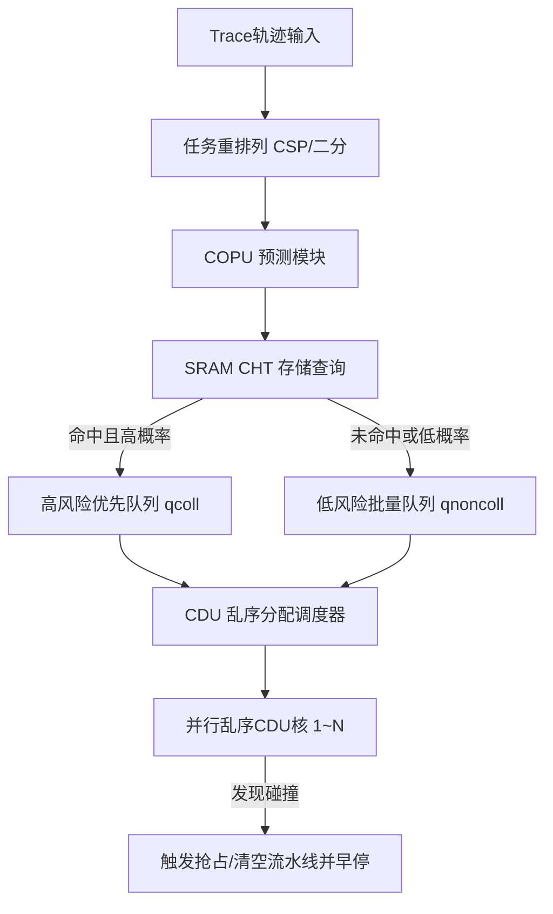

# 运动规划集成仿真与硬件微架构模拟模块 (motion_planning_prediction)

该模块实现了**体系结构级**的周期精确（Cycle-accurate）微架构仿真器，用于评估将“**碰撞预测单元 (COPU)** + **碰撞检测单元 (CDU)**”双层硬件体系结构集成进机器人运动规划算法（如 BIT*、MPNet、GNNMP）时的系统级性能表现。

其核心价值在于探索软硬件协同设计（HW/SW Co-design），通过硬件级的流水线、优先级队列、多 Bank SRAM 冲突和乱序执行模拟，评估系统的时钟周期开销、带宽冲突率和能效表现。

---

## 📁 目录结构与文件分布

```
motion_planning_prediction/
├── simulation_core/          # 核心：周期精确的硬件单元仿真模型
│   ├── constants.py          # 硬件常量配置 (CDU 数量、SRAM 延迟、时钟周期等)
│   ├── cht.py                # 碰撞哈希表 (CHT) 硬件 SRAM 模型 (单/双端口、多 Bank)
│   ├── cht_access_scheduler.py# CHT 的 SRAM 端口冲突与调度器
│   ├── copu_module.py        # 碰撞预测单元 (COPU) 模型，控制分类与入队
│   ├── global_oocd_scheduler.py# 全局乱序碰撞检测分配调度器
│   ├── oocd_processor.py     # CDU 乱序计算执行逻辑与抢占/状态机管理
│   ├── simulators.py         # 顶层系统仿真循环 (标准、抢占式、双缓冲、实测周期等)
│   ├── data_loader.py        # 仿真输入 Trace 轨迹数据的加载器
│   ├── data_preprocessing.py # 数据的重排列 (如 CSP 重排、二分重排)
│   └── perf_analyse.py       # 性能收集与统计模块
├── strategy_evaluation/      # 各种硬件优化策略的测试与仿真运行入口
│   ├── prediction_simulation_nDOF.py # 标准 n-DOF 预测仿真入口
│   ├── prediction_simulation_nDOF_preemptive.py # 抢占式 CDU 仿真
│   ├── prediction_simulation_nDOF_double_buffer.py # 双缓冲区流水线仿真
│   ├── prediction_simulation_nDOF_dedicated.py # 专用通道仿真
│   ├── prediction_simulation_nDOF_real_cycles.py # 使用非均匀 CDU 真实周期的仿真
│   ├── prediction_simulation_sphere_link.py # 多球体与 OBB 表达性能对比仿真
│   ├── global_oocd_simulation.py # 全局乱序调度仿真
│   ├── run_multi_copu_sim.sh # 运行多核 COPU 仿真脚本
│   └── ...                   # 各种对比实验的启动脚本 (run_*.sh)
├── scripts/                  # 论文图表一键复现脚本
│   ├── launch_bit.sh         # 运行基准与预测算法的对比测试并导出 CSV
│   ├── fig15.sh              # Figure 15 (Link/Sphere 周期对比) 复现脚本
│   └── fig16.sh              # Figure 16 (硬件设计折衷分析) 复现脚本
├── plots/                    # 绘图脚本目录
│   ├── plot_fig15.py         # 绘制论文 Figure 15 柱状图
│   ├── plot_fig16.py         # 绘制论文 Figure 16 各子图
│   ├── plot_cht_comparison.py# CHT 缓存冲突率与性能分析图
│   └── ...                   # 其他可视化与消融实验绘图脚本
├── CSP_simulation_2D.py      # 二维 CSP 启发式基线方法仿真
├── CSP_simulation_nDOF.py    # n-DOF 关节空间 CSP 基线方法仿真
├── prediction_simulation_2D.py# 二维运动规划预测仿真入口
└── simulation_utils.py       # 仿真通用辅助函数
```

---

## 🛠️ 体系结构仿真原理与核心代码解析

双层预测检测体系结构（COPU + CDU）模拟了硬件级别的执行流水线。每个运动规划请求被转化为包含多条路径段（Edges），每条路径段包含多帧位姿（Poses），每帧位姿包含多个连杆（Links）的几何碰撞检测任务。



### 1. 硬件 SRAM 碰撞哈希表 (`simulation_core/cht.py`)
为了在硬件上快速查询，哈希字典被映射到硬件 SRAM 上，支持并发访问和 Bank 冲突模拟：
*   **`DualPortSRAM_CHT`**：模拟双端口 SRAM，每个时钟周期支持 2 次独立的读/写访问。如果周期内请求数多于端口数，则产生端口冲突。
*   **`MultiBankSRAM_CHT`**：将 CHT 划分到多个独立的 Memory Bank 中。当多个 COPU 并发访问时，如果不同 COPU 请求同一个 Bank，将引发 **Bank 冲突（Bank Conflict）**，调度器会将冲突的请求延迟到下一周期，此处的物理冲突率直接影响流水线的停顿（Stall）。

### 2. 预测单元与双优先级队列 (`simulation_core/copu_module.py`)
COPU 接收输入路径的任务序列，根据当前敏感度阈值 $S$ 查询 CHT，并将任务分配到不同的硬件缓冲队列中：
*   **`qcoll` (高风险队列)**：存放 CHT 预测发生碰撞的任务，具有最高的派发优先级，希望能尽快被 CDU 执行，以触早停机制（Early Stopping）。
*   **`qnoncoll` (低风险队列)**：存放预测为安全的任务，其深度通常较大（如 56 个条目），主要用于在 CDU 空闲时进行宽流水线吞吐。

### 3. 并行乱序 CDU 与抢占器 (`simulation_core/oocd_processor.py`)
CDU（由参数 `NUM_OOCDS` 决定核心数，如 32 核）以乱序（Out-of-Order）执行碰撞任务：
*   **乱序派发与完成**：调度器优先将任务从 `qcoll` 派发至空闲的 CDU 单元。由于每个连杆的几何复杂度或算法不同，执行的周期数可能不同，先分派的任务不一定先完成。
*   **早停抢占机制 (Preemption)**：一旦某一个 CDU 完成计算并返回“发生碰撞”，系统会触发硬件抢占逻辑：立即清空 COPU 中的缓冲队列（`qcoll`, `qnoncoll`）和当前正在执行的其他 CDU 核（清空流水线），并直接判定该段路径发生碰撞，从而节约了大量无用功时钟周期。

### 4. 仿真引擎循环 (`simulation_core/simulators.py`)
该文件包含顶层仿真主循环，每个 cycle 时钟向前步进，并在周期内依次处理：
1.  **SRAM 端口与 Bank 冲突解析**，计算存储器等待延迟。
2.  **CDU 执行进度推进**，处理已经完成的任务。
3.  **预测任务队列填充**（COPU 端获取新任务并哈希预测分类）。
4.  **任务派发分发**（CDU 端口分配）。
5.  **碰撞早停判断**，以及当发生碰撞时复位硬件状态。

---

## 📊 实验与图表复现指南

仿真数据和图表复现的入口在 `scripts/` 目录中：

### 1. 复现 Figure 15 (不同运动规划器集成周期对比)
Figure 15 评估了 MPNet, BIT* 和 GNNMP 规划算法在 2D 和 7-DOF（7维自由度）场景下，采用 Link Hashing 和 Sphere Hashing 策略时的总执行时钟周期消耗：
```bash
cd motion_planning_prediction/scripts
bash fig15.sh
```
*   **运行步骤**:
    1.  脚本首先调用 `launch_bit.sh`，运行 2D 和 7D 下的基线仿真（不带预测的 CSP 基线）和预测优化仿真，输出 csv 数据至 `result_files/`。
    2.  调用 `plots/plot_fig15.py`，读取 csv 文件并计算平均周期。
*   **输出结果**: 生成不同规划器和自由度场景下的执行周期对比柱状图 `15a_mpnet_7d.pdf`, `15b_mpnet_2d.pdf` 等。

### 2. 复现 Figure 16 (硬件架构设计折衷分析)
Figure 16 探究了不同的硬件参数（如 SRAM 端口数、Bank 数、缓冲队列大小、核数）对系统吞吐量和冲突率的消融实验：
```bash
cd motion_planning_prediction/scripts
bash fig16.sh
```
*   **运行步骤**:
    1.  执行 sensitivity 仿真，输出不同 Bank 分数下的冲突延迟曲线。
    2.  调用 `plots/plot_fig16.py` 和 `plots/plot_fig16_oracle.py` 进行数据统计与图表绘制。
*   **输出结果**: 生成 CHT 访问冲突、Bank 规模与延迟关系等折衷折线图。
